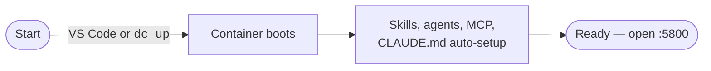

# `weup` — Dev Container

A turnkey dev container with Claude Code, ruflo, Specula (TLA+), DFAI proxy,
GUI/VNC, DinD + k3s, and the Dark Factory skill set baked in.

## Start

Pick one — both produce the same container.

**VS Code:**

```bash
code .                 # then: "Dev Containers: Reopen in Container"
```

**Plain Docker:**

```bash
bash .devcontainer/scripts/dc up
```

That's it. Skills, agents, MCP server and CLAUDE.md auto-setup all happen
on boot. Open <http://localhost:5800> when it's up — credentials are in
`.devcontainer/.env` (`cat .devcontainer/.env`).



## Use Claude Code

**1. Via VS Code Dev Containers** — open the folder in VS Code and reopen
in container. The integrated terminal lands you inside as `administrator`
with `claude` on `$PATH`:

```bash
claude
```

**2. Manually via `docker exec`** — works without VS Code:

```bash
docker ps                                              # find the container name
docker exec -it --user=1000 <container-name> bash
# or the shortcut:  bash .devcontainer/scripts/dc exec

claude
```

**Drive Claude Code from a browser or mobile** — inside the session run
`/remote-control` to expose a web control surface, then connect from any
device on the same network (or via your VPN if `BIND_IP` is set to a VPN
address).

## Project hooks (optional)

Drop either of these into `scripts/` — they run inside the container with
your `.env` already loaded:

| File | Runs |
|---|---|
| `scripts/post-create-hook.sh` | Once, on first start. Use for `pnpm install`, DB migrations, fixtures. |
| `scripts/post-start-hook.sh`  | Every container start. Use for rotating tokens, warming caches, starting dev servers. |

A `.example` of `post-create-hook.sh` ships in `scripts/`.

## Config

Two `.env` files load automatically (both optional):

- `<project>/.env` — your app secrets (`DATABASE_URL`, `API_KEY`, …)
- `.devcontainer/.env` — devcontainer knobs (auto-generated on first start)

Common overrides in `.devcontainer/.env`:

| Variable                        | Default       | Notes                                  |
|---------------------------------|---------------|----------------------------------------|
| `BACKEND_PORT`                  | 8091          | App backend                            |
| `VNC_PORT`                      | 5800          | noVNC GUI                              |
| `BIND_IP`                       | 127.0.0.1     | Set to VPN IP for team sharing         |
| `SKIP_AUTO_UPDATE`              | `0`           | `1` to skip auto-update on boot        |
| `CLAUDE_CODE_VERSION`           | latest        | Pin e.g. `1.0.x`                       |
| `RUFLO_VERSION`                 | latest        | Pin e.g. `0.x.y`                       |
| `DARKFORGE_IMAGE`               | `hub.soc.one/library/darkforge:latest` | Custom image tag |

Rotate GUI passwords: `rm .devcontainer/.env` then restart the container.

## Custom image (extend the base)

Need extra system packages, language toolchains, or pre-installed tools?
Build your own image on top of `darkforge:latest`.

**1. Create `.devcontainer/Dockerfile`:**

```dockerfile
FROM hub.soc.one/library/darkforge:latest

USER root

# Example: extra apt packages
RUN apt-get update && apt-get install -y --no-install-recommends \
        postgresql-client redis-tools \
    && rm -rf /var/lib/apt/lists/*

# Example: extra Python / Node tools (use the baked managers)
RUN pip install --no-cache-dir poetry httpie \
 && npm install -g typescript vercel

# Always end as the unprivileged user — the baseimage drops privileges
# automatically at runtime, but tooling expects this default.
USER administrator
```

**2. Point compose at it.** In `.devcontainer/docker-compose.yml`,
replace the `image:` line with a `build:` block:

```yaml
services:
  dev:
    # image: ${DARKFORGE_IMAGE:-hub.soc.one/library/darkforge:latest}
    build:
      context: .
      dockerfile: Dockerfile
```

**3. Rebuild:**

```bash
bash .devcontainer/scripts/dc up --build
# or in VS Code: "Dev Containers: Rebuild Container"
```

Everything in the base image (Claude Code, ruflo, skills, MCP, GUI, DinD)
keeps working — you're just layering on top.

## GPU workloads (opt-in)

For CUDA / PyTorch / ML workloads, layer the GPU overlay on top of the base
compose file. Host needs the NVIDIA driver + `nvidia-container-toolkit`.

In `.devcontainer/devcontainer.json`, change:

```jsonc
"dockerComposeFile": ["docker-compose.yml", "docker-compose.gpu.yml"]
```

Or with raw `docker compose`:

```bash
docker compose -f docker-compose.yml -f docker-compose.gpu.yml up -d
```

Restrict GPUs via `.env`:

```env
NVIDIA_VISIBLE_DEVICES=0,1   # only GPUs 0 and 1; default: all
GPU_COUNT=1                  # how many to reserve; default: all
```

Verify inside the container with `nvidia-smi`. See
`docker-compose.gpu.yml` for the full list of tunables.

## DFAI recovery

```bash
dfai-restart status     # health + process tree
dfai-restart            # smart: tries soft → hard → nuke as needed
dfai-restart hard       # kill uvicorn + relaunch
dfai-restart nuke       # SIGKILL everything dfai + cold-start (use when hard hangs)
```

## Update

```bash
docker pull hub.soc.one/library/darkforge:latest
# Then: "Dev Containers: Rebuild Container" (or `dc up` again)
```

If you use a custom `Dockerfile`, also rebuild it: `dc up --build`.

## gitignore

```
.devcontainer/.env
.devcontainer/*.bak
```
