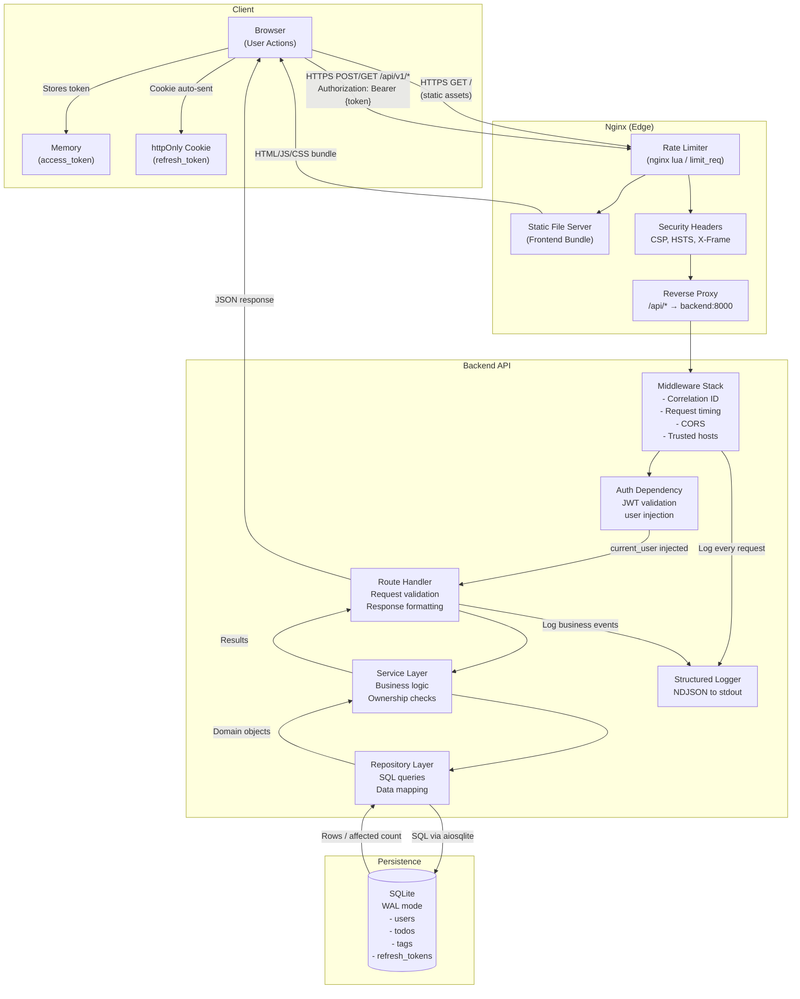
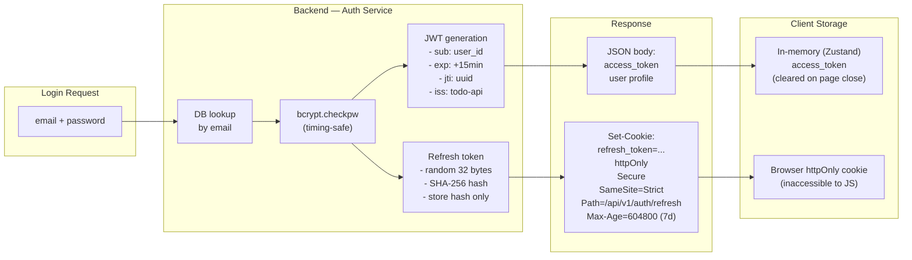
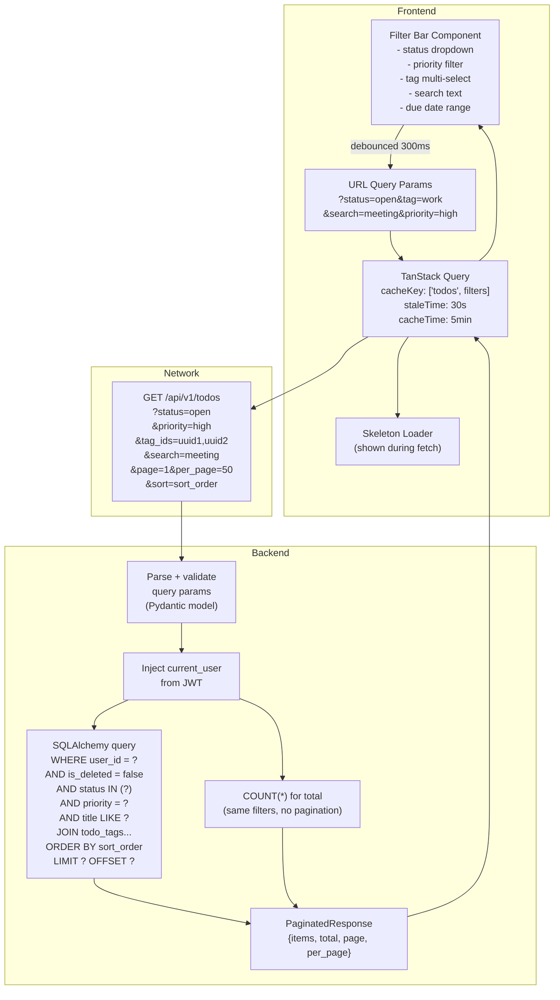
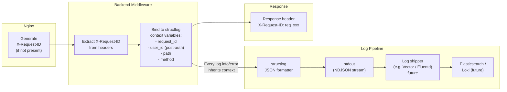
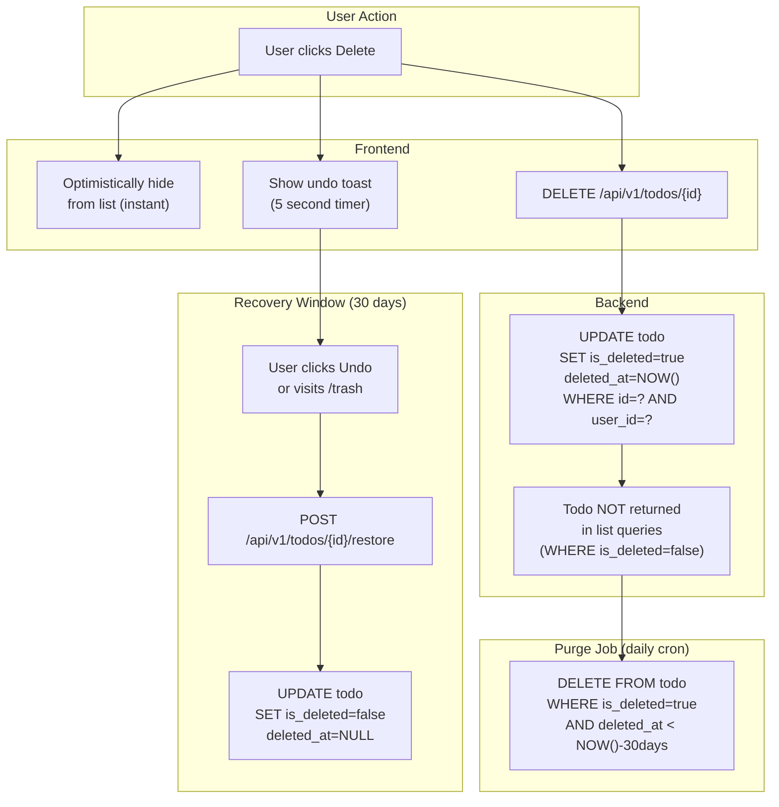

# Data Flow Diagrams

**Version:** 1.0.0 | **Date:** 2026-05-27

---

## System-Level Data Flow

---

## Authentication Data Flow

---

## Todo Query Data Flow (List with Filters)

---

## Request Correlation & Observability Data Flow

---

## Soft Delete & Recovery Data Flow

