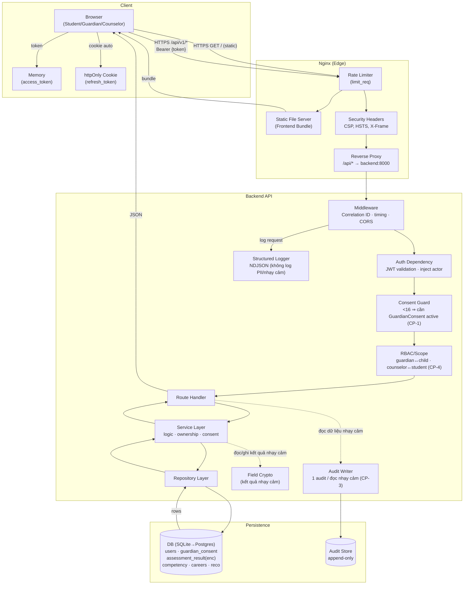
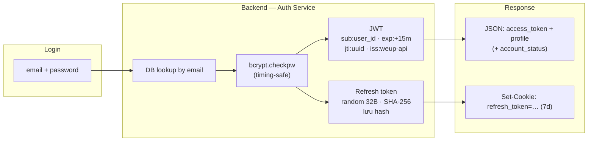
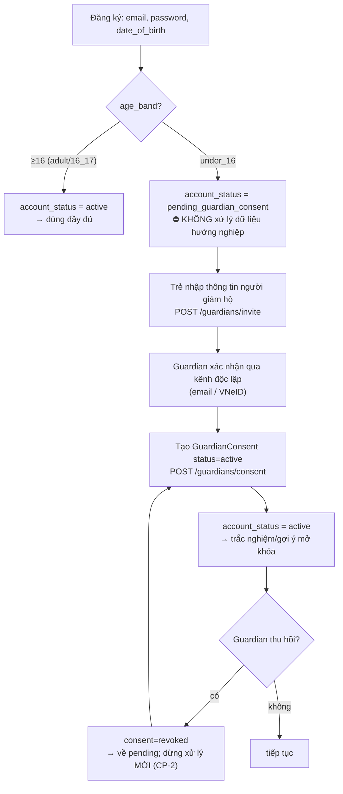
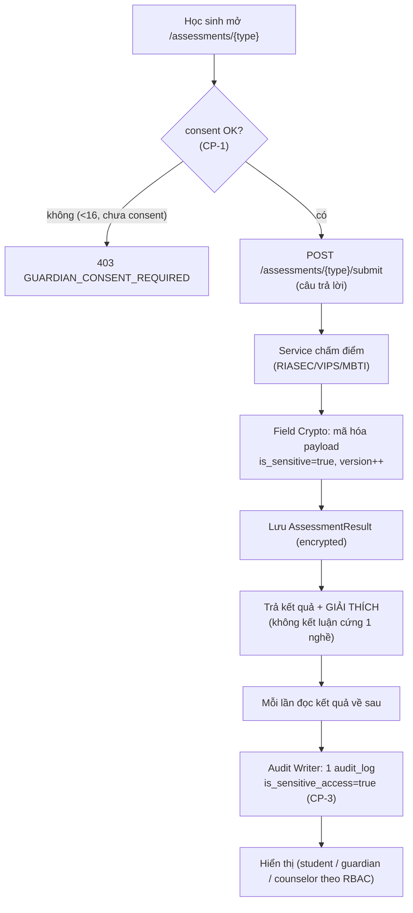
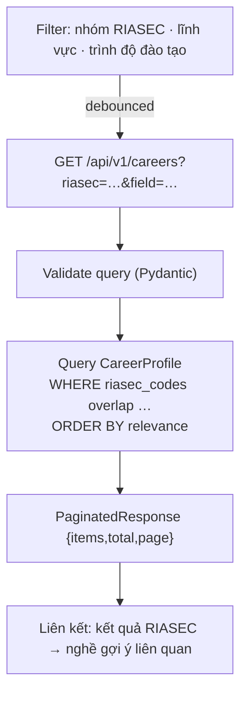
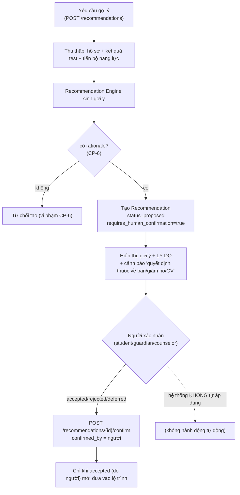
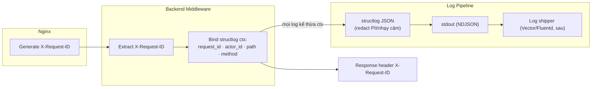
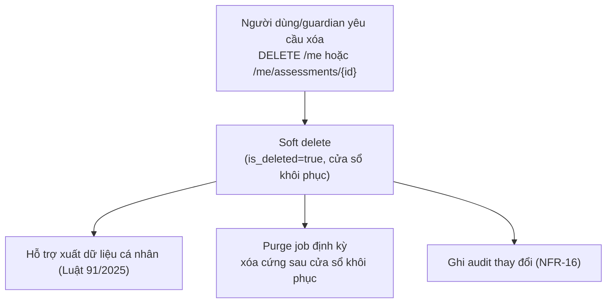

# Sơ đồ Luồng Dữ liệu — WeUp Career

**Phiên bản:** 2.0.0 | **Ngày:** 2026-05-29

> Neo vào [`docs/spec.md`](../spec.md) §8 (CP-1…CP-8) và [`docs/legal/legal-basis.md`](../legal/legal-basis.md). Các luồng nhấn mạnh **cổng đồng ý giám hộ**, **xử lý dữ liệu nhạy cảm + audit**, và **gợi ý human-in-the-loop**.

---

## Luồng dữ liệu cấp hệ thống

---

## Luồng xác thực (Authentication)

> Nếu `account_status = pending_guardian_consent`, đăng nhập thành công nhưng frontend **chặn route dữ liệu hướng nghiệp** và điều hướng tới luồng giám hộ.

---

## ⭐ Luồng đăng ký + Đồng ý giám hộ (<16) — CP-1/CP-2

**Bất biến (TLA+ ConsentLifecycle):** không có `AssessmentResult`/`Recommendation` nào của user `under_16` được tạo khi không có consent `active` (CP-1); sau thu hồi, không xử lý mới đến khi active lại (CP-2).

---

## ⭐ Luồng làm trắc nghiệm (RIASEC/VIPS/MBTI) — dữ liệu nhạy cảm + audit

> Kết quả gắn `competency_code` (chủ yếu NL1) + `dieu5_code=b`. Item ưu tiên nguồn **ILO Việt Nam** (sources.md §2). Người dùng/guardian có thể **xuất/xóa** (quyền chủ thể dữ liệu).

---

## Luồng thư viện nghề (Career Library) — Điều 5(a)

> Thư viện nghề **versioned**, rà soát/cập nhật định kỳ (TT 16/2026); bao gồm nhánh GDNN & "trường trung học nghề" (Luật GDNN 124/2025).

---

## ⭐ Luồng gợi ý có giải thích (Human-in-the-loop) — CP-5/CP-6

**Bất biến (TLA+ RecommendationGovernance):** không gợi ý nào thiếu `rationale` (CP-6); không gợi ý nào có hiệu lực khi chưa có người xác nhận (CP-5). Trùng khớp nguyên tắc **không ép buộc phân luồng** (TT 16/2026) + **AI có kiểm soát** (Luật 134/2025 Đ.4).

---

## Luồng Correlation & Observability

---

## Luồng xóa mềm tài khoản & quyền chủ thể dữ liệu

> Với trẻ <16, **guardian** thực hiện được quyền xóa/xuất thay trẻ. Thu hồi consent (CP-2) là một dạng dừng xử lý, khác với xóa dữ liệu.
