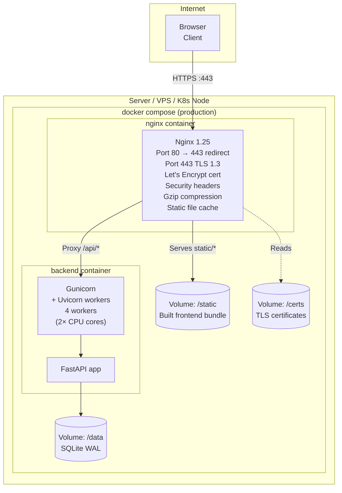
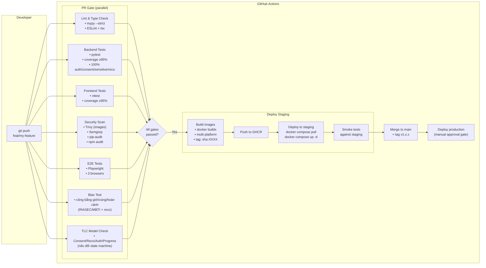

# Deployment Architecture — WeUp Career

**Version:** 2.0.0 | **Date:** 2026-05-29

> Hạ tầng cho nền tảng hướng nghiệp quốc gia. Lưu ý dữ liệu nhạy cảm (kết quả RIASEC/VIPS/MBTI) cần khóa mã hóa trường (`FIELD_ENCRYPTION_KEY`) và ưu tiên PostgreSQL ở production (xem [`docs/scalability/strategy.md`](../scalability/strategy.md)). CI bao gồm gate **bias test** + **TLC** (spec.md §7 Gate B).

---

## Local Development (Docker Compose)

```mermaid
graph TB
    subgraph "Developer Machine"
        subgraph "docker compose up"
            NGINX["nginx:alpine<br/>:80 → :443<br/>TLS termination<br/>Static file serving<br/>Rate limiting"]
            
            subgraph "frontend container"
                VITE["Next.js dev server<br/>:3000 (next dev)<br/>HMR + RSC/Fast Refresh<br/>React 19 + TypeScript"]
            end
            
            subgraph "backend container"
                UVICORN["Uvicorn<br/>:8000<br/>Python 3.12<br/>FastAPI app<br/>Auto-reload"]
                SQLITE[("SQLite file<br/>app.db<br/>WAL mode")]
            end
            
            NGINX -->|"/| VITE
            NGINX -->|"/api/*"| UVICORN
            UVICORN --> SQLITE
        end
        
        VOL1[("Volume: ./data/<br/>Persists SQLite")]
        VOL2[("Volume: ./backend/<br/>Live code reload")]
        VOL3[("Volume: ./frontend/<br/>Live code reload")]
        
        UVICORN -.->|bind mount| VOL2
        VITE -.->|bind mount| VOL3
        SQLITE -.->|persisted| VOL1
    end
```

### docker-compose.yml (Development)

```yaml
version: '3.9'
services:
  nginx:
    image: nginx:1.25-alpine
    ports: ["80:80"]
    volumes:
      - ./nginx/nginx.dev.conf:/etc/nginx/nginx.conf:ro
    depends_on: [frontend, backend]

  frontend:
    build:
      context: ./frontend
      target: development
    volumes:
      - ./frontend:/app
      - /app/node_modules
    environment:
      - VITE_API_URL=/api/v1

  backend:
    build:
      context: ./backend
      target: development
    volumes:
      - ./backend:/app
      - ./data:/data
    environment:
      - DATABASE_URL=sqlite+aiosqlite:////data/app.db
      - SECRET_KEY=${SECRET_KEY}
      - ENVIRONMENT=development
    depends_on: []
```

---

## Production Deployment



### docker-compose.prod.yml

```yaml
version: '3.9'
services:
  nginx:
    image: nginx:1.25-alpine
    ports: ["80:80", "443:443"]
    volumes:
      - ./nginx/nginx.prod.conf:/etc/nginx/nginx.conf:ro
      - frontend_build:/usr/share/nginx/html:ro
      - ./certs:/etc/nginx/certs:ro
    restart: unless-stopped
    depends_on: [backend]

  backend:
    image: ghcr.io/org/weup-career-backend:${VERSION}
    volumes:
      - app_data:/data
    environment:
      - DATABASE_URL=sqlite+aiosqlite:////data/app.db
      - SECRET_KEY_FILE=/run/secrets/secret_key
      - FIELD_ENCRYPTION_KEY_FILE=/run/secrets/field_encryption_key  # mã hóa kết quả trắc nghiệm (NFR-10)
      - ENVIRONMENT=production
      - LOG_LEVEL=info
    secrets: [secret_key, field_encryption_key]
    restart: unless-stopped
    deploy:
      resources:
        limits:
          cpus: '2.0'
          memory: 512M

volumes:
  app_data:
    driver: local
  frontend_build:
    external: true

secrets:
  secret_key:
    file: ./secrets/secret_key.txt
  field_encryption_key:
    file: ./secrets/field_encryption_key.txt
```

---

## CI/CD Pipeline



---

## Multi-Stage Docker Builds

### Backend Dockerfile

```
Stage 1: python:3.12-slim (builder)
  - Install build deps
  - pip install via uv (fast resolver)
  - Compile .pyc files

Stage 2: python:3.12-slim (runtime)  
  - Copy only installed packages from builder
  - NO build tools, NO pip, NO gcc
  - Run as non-root user (uid=1000)
  - HEALTHCHECK built-in
  - Final image: ~180MB
```

### Frontend Dockerfile

```
Stage 1: node:20-alpine (builder)
  - npm ci (frozen lockfile)
  - npm run build (next build)
  - Output: .next/ (standalone)

Stage 2: node:20-alpine (runtime)        # Node runtime — RSC public Điều 5a cần server-render
  - Copy .next/standalone + .next/static + public/
  - CMD ["node", "server.js"]  (next start, :3000)
  - Run as non-root (uid=1000), HEALTHCHECK built-in
  - Final image: ~140MB

# Nginx reverse-proxy tới Node runtime này (KHÔNG còn static-only + index.html
# fallback). Static assets (.next/static, /public) có thể để nginx cache/serve
# trực tiếp; mọi route khác proxy sang Next.js để RSC/ISR hoạt động.
```

---

## Scaling Path

### Phase 1 (Current): Single-node SQLite

```
Internet → Nginx → Backend (1 process) → SQLite
```

### Phase 2: Multi-worker (single node)

```
Internet → Nginx → Backend (Gunicorn, 4-8 workers) → SQLite (WAL)
           (WAL mode allows concurrent reads; serialized writes)
```

### Phase 3: PostgreSQL migration (horizontal scale)

```
Internet → Load Balancer → Nginx (×N) → Backend (×N) → PostgreSQL (primary + replica)
```

**Migration cost:** Change `DATABASE_URL` env var + adjust `alembic.ini` connection string. SQLAlchemy ORM code is **unchanged** — this is by design.

### Phase 4: Full cloud-native

```
Internet → CDN (CloudFront/Cloudflare) → 
  Static assets: S3/R2
  API: ECS/EKS cluster → PostgreSQL RDS → Redis (session/cache)
```
