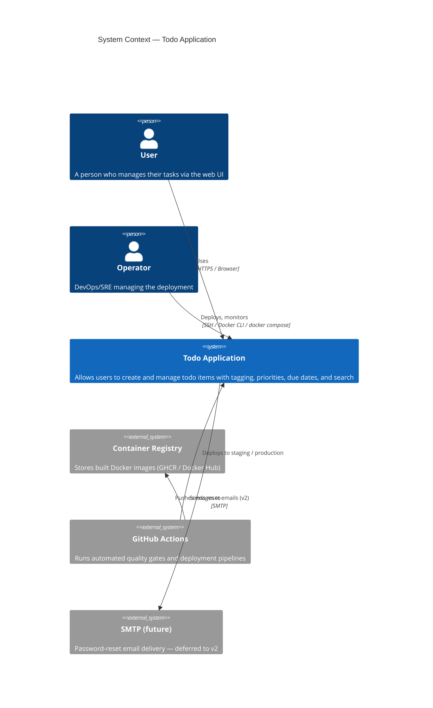
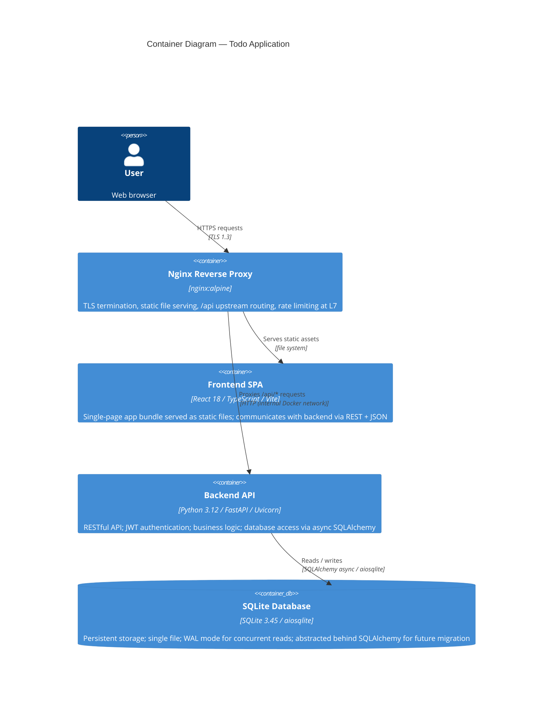
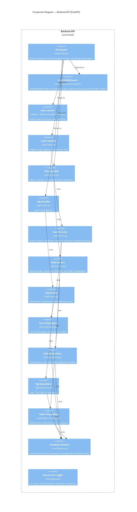
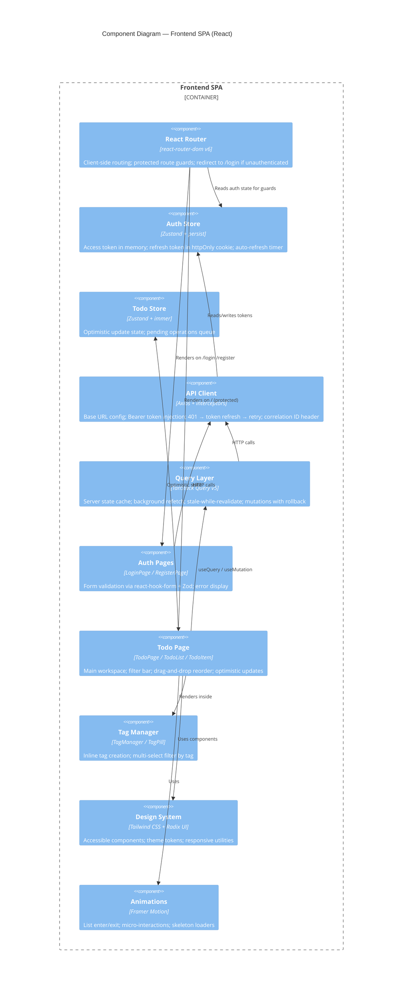
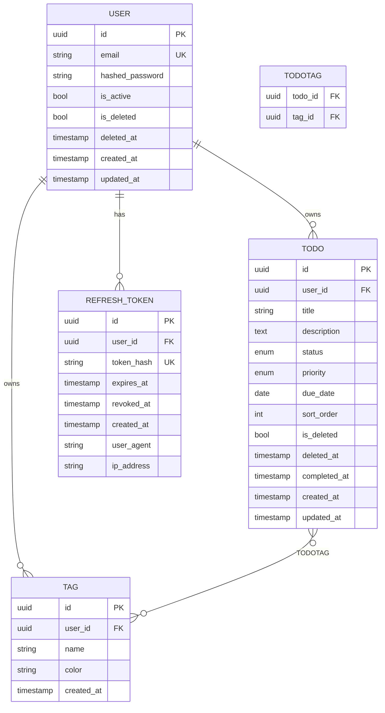

# System Architecture Overview

**Version:** 1.0.0 | **Status:** APPROVED FOR REVIEW | **Date:** 2026-05-27

---

## C4 Model

### Level 1 — System Context



---

### Level 2 — Container Diagram



---

### Level 3 — Component Diagram — Backend API



---

### Level 3 — Component Diagram — Frontend SPA



---

## Frontend Architecture Detail

### Directory Structure

```
frontend/
├── src/
│   ├── api/            # Axios client + all API functions (typed)
│   ├── components/     # Reusable UI components (design system layer)
│   ├── features/       # Feature modules (auth/, todos/, tags/)
│   │   ├── auth/       # Login, Register, AuthGuard
│   │   ├── todos/      # TodoList, TodoItem, CreateTodoForm, FilterBar
│   │   └── tags/       # TagManager, TagPill, TagFilter
│   ├── hooks/          # Custom React hooks
│   ├── pages/          # Route-level page components
│   ├── store/          # Zustand stores (auth, todo)
│   ├── types/          # TypeScript type definitions (shared with API)
│   ├── lib/            # Utilities (date formatting, validation schemas)
│   └── main.tsx        # App entry point
├── public/
├── index.html
├── vite.config.ts
├── tailwind.config.ts
├── vitest.config.ts
└── playwright.config.ts
```

### State Management Architecture

```
┌─────────────────────────────────────────────────────────┐
│                    React Component Tree                  │
│                                                         │
│  ┌──────────────┐    ┌──────────────────────────────┐   │
│  │  Auth Store  │    │      TanStack Query Cache    │   │
│  │  (Zustand)   │    │  [todos, tags, user profile] │   │
│  │              │    │  stale-while-revalidate       │   │
│  │ - token      │    │  optimistic mutations         │   │
│  │ - user       │    │  background sync              │   │
│  │ - isLoading  │    └──────────────┬───────────────┘   │
│  └──────┬───────┘                   │                   │
│         │                           ▼                   │
│         └──────────► Axios API Client ──► Backend API   │
└─────────────────────────────────────────────────────────┘
```

**Design principle:** Server state (todo data) lives in TanStack Query. Client-only state (auth tokens, UI preferences) lives in Zustand. No duplication.

---

## Backend Architecture Detail

### Hexagonal Architecture (Ports & Adapters)

```
┌──────────────────────────────────────────────────────────────┐
│                        HTTP Layer (FastAPI)                   │
│  Request → Validation → Dependency Injection → Handler       │
└────────────────────────┬─────────────────────────────────────┘
                         │ calls
┌────────────────────────▼─────────────────────────────────────┐
│                      Service Layer                           │
│  (Business Logic — no framework imports, pure Python)        │
│                                                              │
│  AuthService  │  TodoService  │  TagService                  │
└────────────────────────┬─────────────────────────────────────┘
                         │ calls (via Port interface)
┌────────────────────────▼─────────────────────────────────────┐
│                    Repository Layer (Port)                    │
│  Abstract base classes; injectable; testable with in-memory  │
│                                                              │
│  IUserRepo  │  ITodoRepo  │  ITagRepo  │  ITokenRepo         │
└────────────────────────┬─────────────────────────────────────┘
                         │ implemented by
┌────────────────────────▼─────────────────────────────────────┐
│              SQLAlchemy Adapters (Adapter Layer)             │
│  Concrete SQLAlchemy implementations; SQLite today           │
│  Swap to Postgres by changing the adapter + connection URL   │
└──────────────────────────────────────────────────────────────┘
```

### Directory Structure

```
backend/
├── app/
│   ├── main.py             # FastAPI app factory
│   ├── core/
│   │   ├── config.py       # Pydantic settings (env vars)
│   │   ├── database.py     # AsyncSession factory, lifespan
│   │   ├── security.py     # JWT encoding/decoding, password hashing
│   │   ├── logging.py      # structlog configuration
│   │   ├── middleware.py   # Correlation ID, request timing
│   │   └── exceptions.py  # Custom exception hierarchy
│   ├── auth/
│   │   ├── router.py       # /auth/* endpoints
│   │   ├── service.py      # Token lifecycle, auth logic
│   │   ├── models.py       # SQLAlchemy: User, RefreshToken
│   │   ├── schemas.py      # Pydantic request/response schemas
│   │   ├── repository.py   # UserRepo, TokenRepo (abstract + SQL)
│   │   └── dependencies.py # get_current_user, require_active
│   ├── todos/
│   │   ├── router.py
│   │   ├── service.py
│   │   ├── models.py       # SQLAlchemy: Todo
│   │   ├── schemas.py
│   │   └── repository.py
│   ├── tags/
│   │   ├── router.py
│   │   ├── service.py
│   │   ├── models.py       # SQLAlchemy: Tag, TodoTag
│   │   ├── schemas.py
│   │   └── repository.py
│   └── api/
│       └── v1/router.py    # Master router (includes all sub-routers)
├── migrations/             # Alembic
│   ├── env.py
│   └── versions/
├── tests/
│   ├── unit/
│   ├── integration/
│   └── conftest.py
├── pyproject.toml
└── Dockerfile
```

---

## Database Design

### Entity-Relationship Diagram



### Index Strategy

| Table | Index | Type | Reason |
|-------|-------|------|--------|
| user | email | UNIQUE | Login lookup |
| todo | user_id, is_deleted, sort_order | COMPOSITE | List query hot path |
| todo | user_id, status | COMPOSITE | Filter by status |
| todo | user_id, due_date | COMPOSITE | Due date range filter |
| tag | user_id, name | UNIQUE | Per-user uniqueness |
| refresh_token | token_hash | UNIQUE | Token validation |
| refresh_token | user_id, revoked_at | COMPOSITE | Active token lookup |

---

## Error Handling Strategy

### Error Response Schema

```json
{
  "error": {
    "code": "TODO_NOT_FOUND",
    "message": "Todo with id 'abc' not found",
    "details": {},
    "request_id": "req_01HX..."
  }
}
```

### HTTP Status Code Map

| Code | Meaning | When |
|------|---------|------|
| 200 | OK | Successful GET/PATCH |
| 201 | Created | Successful POST |
| 204 | No Content | Successful DELETE |
| 400 | Bad Request | Validation error (Pydantic) |
| 401 | Unauthorized | Missing/invalid/expired access token |
| 403 | Forbidden | Valid token but insufficient permission |
| 404 | Not Found | Resource doesn't exist or not owned |
| 409 | Conflict | Duplicate email on register; duplicate tag name |
| 422 | Unprocessable Entity | Schema error with field-level details |
| 429 | Too Many Requests | Rate limit exceeded (Retry-After header) |
| 500 | Internal Server Error | Unexpected; no stack trace exposed |
| 503 | Service Unavailable | Database unavailable (readiness check) |

### Error Boundary Architecture (Frontend)

```
App
└── ErrorBoundary (catches unhandled React errors → fallback UI)
    └── QueryClientProvider
        └── TanStack Query errors → toast notifications
            └── Axios interceptors → 401 → token refresh → retry
                └── 401 again → logout + redirect /login
```

---

## Observability Strategy

### Structured Log Format

Every log line is NDJSON:

```json
{
  "timestamp": "2026-05-27T10:00:00.000Z",
  "level": "info",
  "service": "todo-api",
  "version": "1.0.0",
  "request_id": "req_01HX...",
  "user_id": "usr_01HX...",
  "method": "POST",
  "path": "/api/v1/todos",
  "status_code": 201,
  "duration_ms": 12,
  "event": "request.completed"
}
```

### Log Levels

| Level | Use |
|-------|-----|
| DEBUG | DB query details, token contents (dev only — never in prod) |
| INFO | Request in/out, business events (todo created, user registered) |
| WARNING | Rate limit approached, slow query (>50ms), token nearing expiry |
| ERROR | Unhandled exception; DB error; auth failure |

### Metrics (future-ready)

Expose `/metrics` endpoint (Prometheus format) via `prometheus-fastapi-instrumentator`:
- `http_requests_total` (method, path, status)
- `http_request_duration_seconds` (histogram)
- `active_users_gauge`
- `todo_operations_total` (operation type)
