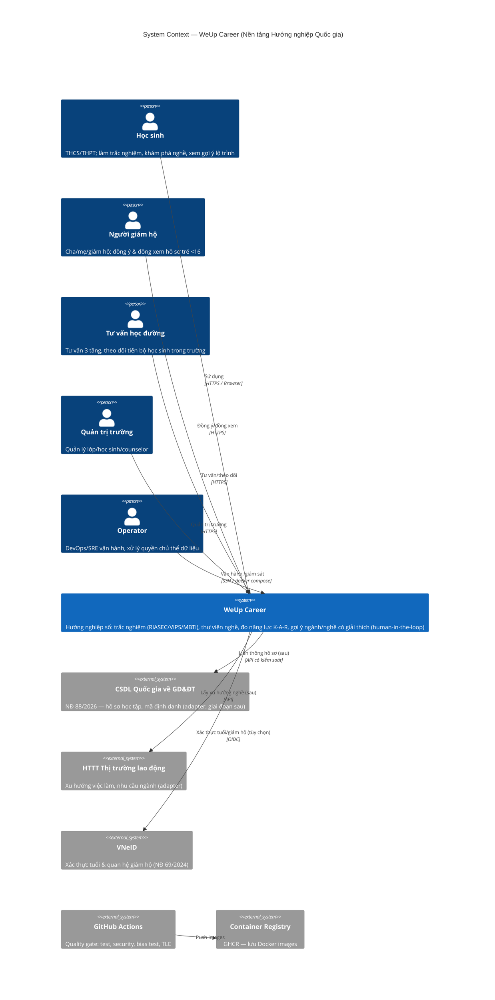
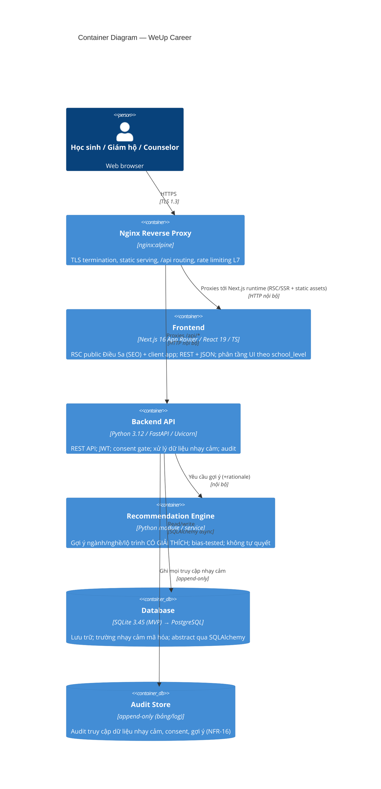
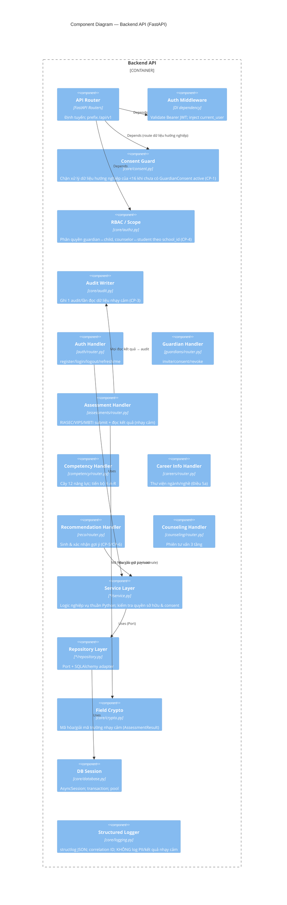
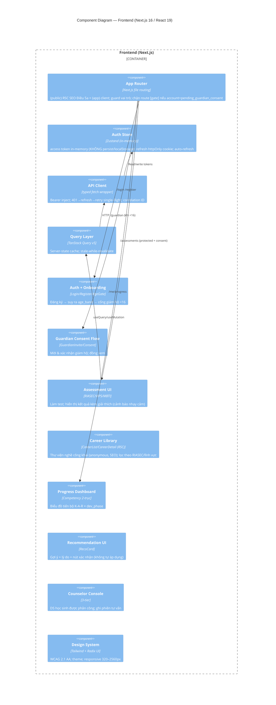
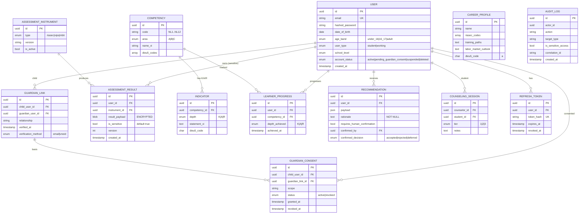

# Tổng quan Kiến trúc Hệ thống — WeUp Career

**Phiên bản:** 2.0.0 | **Trạng thái:** APPROVED FOR REVIEW | **Ngày:** 2026-05-29
**Thay thế:** v1.0.0 (kiến trúc Todo app — placeholder)

> Neo vào [`docs/spec.md`](../spec.md) (data model §5, CP §8), [`docs/research/career-frameworks-synthesis.md`](../research/career-frameworks-synthesis.md) (mô hình 2 trục), [`docs/legal/legal-basis.md`](../legal/legal-basis.md) (consent <16, dữ liệu nhạy cảm, AI governance). Quy ước: văn xuôi tiếng Việt, định danh kỹ thuật tiếng Anh.

---

## Mô hình C4

### Level 1 — System Context



> **Ràng buộc context:** một tỷ lệ đáng kể người dùng là **học sinh <16 tuổi** → mọi luồng dữ liệu phải đi qua **cổng đồng ý giám hộ** (CP-1). Gợi ý nghề là **hệ thống AI có kiểm soát** → bắt buộc giải thích được + human-in-the-loop (CP-5/CP-6).

---

### Level 2 — Container Diagram



> **Quyết định stack** giữ theo ADR-001/002/003: FastAPI + React/TS + SQLAlchemy, SQLite (MVP) → PostgreSQL khi scale (xem [`docs/scalability/strategy.md`](../scalability/strategy.md)). `Recommendation Engine` tách module để cô lập ranh giới AI governance (giải thích/bias/human-in-the-loop).

---

### Level 3 — Component Diagram — Backend API



---

### Level 3 — Component Diagram — Frontend (Next.js App Router)



---

## Chi tiết kiến trúc Frontend

### Cấu trúc thư mục
```
frontend/
├── src/
│   ├── api/            # Axios client + hàm API (typed)
│   ├── components/     # UI tái sử dụng (design system)
│   ├── features/
│   │   ├── auth/       # Login, Register, AgeGate, AuthGuard
│   │   ├── guardian/   # GuardianInvite, ConsentFlow, ChildLink
│   │   ├── assessment/ # RIASEC, VIPS, MBTI, ResultView
│   │   ├── competency/ # ProgressDashboard (2-trục K-A-R × phase)
│   │   ├── careers/    # CareerList, CareerDetail, Filters
│   │   ├── reco/       # RecommendationCard, ConfirmDialog
│   │   ├── wellbeing/  # Module sức khỏe tinh thần (ABCD NL4)
│   │   └── counseling/ # CounselorConsole, SessionForm
│   ├── hooks/  ├── pages/  ├── store/  ├── types/  ├── lib/
│   └── main.tsx
├── vite.config.ts ├── tailwind.config.ts
├── vitest.config.ts └── playwright.config.ts
```

**Nguyên tắc state:** Server-state (kết quả test, năng lực, nghề, gợi ý) ở TanStack Query; client-state (token, preference UI) ở Zustand. Không trùng lặp. **Kết quả trắc nghiệm nhạy cảm không cache lâu ở client**, không lưu localStorage.

---

## Chi tiết kiến trúc Backend

### Hexagonal (Ports & Adapters)
```
┌───────────────────────────────────────────────────────────┐
│  HTTP Layer (FastAPI)                                       │
│  Request → Validation → Auth → Consent Guard → RBAC → Handler│
└──────────────────────────┬────────────────────────────────┘
                           │ calls
┌──────────────────────────▼────────────────────────────────┐
│  Service Layer (logic thuần Python, không import framework) │
│  AuthService │ ConsentService │ AssessmentService │         │
│  CompetencyService │ CareerService │ RecommendationService │ │
│  CounselingService                                          │
└──────────────────────────┬────────────────────────────────┘
                           │ via Port
┌──────────────────────────▼────────────────────────────────┐
│  Repository Layer (Port — abstract, testable in-memory)     │
│  IUserRepo │ IConsentRepo │ IAssessmentRepo │ ICompetencyRepo│
│  ICareerRepo │ IRecoRepo │ IAuditRepo                        │
└──────────────────────────┬────────────────────────────────┘
                           │ implemented by
┌──────────────────────────▼────────────────────────────────┐
│  SQLAlchemy Adapters — SQLite (MVP) → PostgreSQL            │
│  Trường nhạy cảm đi qua Field Crypto trước khi ghi          │
└───────────────────────────────────────────────────────────┘
```

### Cấu trúc thư mục
```
backend/
├── app/
│   ├── main.py
│   ├── core/
│   │   ├── config.py  ├── database.py  ├── security.py
│   │   ├── consent.py     # Consent Guard (CP-1/CP-2)
│   │   ├── authz.py       # RBAC quan hệ (CP-4)
│   │   ├── audit.py       # Audit writer (CP-3)
│   │   ├── crypto.py      # Field-level crypto cho dữ liệu nhạy cảm
│   │   ├── logging.py  ├── middleware.py  └── exceptions.py
│   ├── auth/              # User, RefreshToken
│   ├── guardians/         # GuardianLink, GuardianConsent
│   ├── assessments/       # Instrument, Item, Result (sensitive)
│   ├── competency/        # Competency, Indicator, LearnerProgress, LearnerDomainPhase
│   ├── careers/           # CareerProfile, ContentItem, Pathway
│   ├── reco/              # Recommendation (rationale, human-in-the-loop)
│   ├── counseling/        # School, SchoolClass, CounselingSession
│   └── api/v1/router.py
├── migrations/            # Alembic
├── tests/{unit,integration}/  conftest.py
├── tla/                   # Đặc tả TLA+ (xem docs/formal-verification)
├── pyproject.toml └── Dockerfile
```

---

## Thiết kế CSDL

### Sơ đồ thực thể (ERD) — theo spec.md §5



### Chiến lược Index

| Bảng | Index | Loại | Lý do |
|------|-------|------|-------|
| user | email | UNIQUE | Login |
| user | age_band, account_status | COMPOSITE | Cổng consent <16 |
| guardian_consent | child_user_id, status | COMPOSITE | Kiểm tra consent active (CP-1, hot path) |
| assessment_result | user_id, instrument_id, version | COMPOSITE | Lấy kết quả mới nhất; versioned |
| learner_progress | user_id, competency_id | COMPOSITE | Bảng tiến bộ K-A-R |
| career_profile | riasec_codes (GIN/JSON) | INDEX | Lọc nghề theo nhóm RIASEC |
| content_item | dieu5_code, competency_id, dev_phase, school_level | COMPOSITE | Phân tầng nội dung |
| recommendation | user_id, confirmed_decision | COMPOSITE | Trạng thái gợi ý |
| audit_log | actor_id, created_at | COMPOSITE | Truy vết |
| refresh_token | token_hash | UNIQUE | Validate token |

> **Lưu ý mã hóa:** `assessment_result.result_payload` mã hóa at-rest (Field Crypto), **không index trên nội dung kết quả** (chỉ index metadata). Truy cập luôn sinh `audit_log` (CP-3).

---

## Chiến lược xử lý lỗi

### Error Response Schema
```json
{
  "error": {
    "code": "GUARDIAN_CONSENT_REQUIRED",
    "message": "Tài khoản dưới 16 tuổi cần đồng ý của người giám hộ trước khi xử lý dữ liệu hướng nghiệp",
    "details": {},
    "request_id": "req_01HX..."
  }
}
```

### Bản đồ HTTP Status

| Code | Khi nào |
|------|---------|
| 200/201/204 | Thành công GET/PATCH / POST / DELETE |
| 400/422 | Lỗi validate (Pydantic) |
| 401 | Thiếu/sai/hết hạn access token |
| 403 | Hợp lệ nhưng không đủ quyền (RBAC), **hoặc thiếu GuardianConsent** (`GUARDIAN_CONSENT_REQUIRED`) |
| 404 | Không tồn tại hoặc không sở hữu |
| 409 | Trùng email khi đăng ký |
| 429 | Vượt rate limit (Retry-After) |
| 451 | (tùy chọn) Không thể xử lý vì lý do pháp lý (consent thu hồi) |
| 500/503 | Lỗi nội bộ (không lộ stack) / DB không sẵn sàng |

---

## Chiến lược Observability

### Định dạng log (NDJSON)
```json
{
  "timestamp": "2026-05-29T10:00:00.000Z",
  "level": "info",
  "service": "weup-api",
  "version": "2.0.0",
  "request_id": "req_01HX...",
  "actor_id": "usr_01HX...",
  "method": "POST",
  "path": "/api/v1/assessments/riasec/submit",
  "status_code": 201,
  "duration_ms": 14,
  "event": "assessment.submitted"
}
```
> ⚠️ **Tuyệt đối không log**: nội dung kết quả trắc nghiệm, payload gợi ý cá nhân, token, PII (NFR-06/NFR-10). Sự kiện nhạy cảm chỉ log *metadata* (loại, thời điểm, actor) + ghi `audit_log` riêng.

### Log levels
| Level | Dùng |
|-------|------|
| DEBUG | Chi tiết query (chỉ dev) |
| INFO | Request in/out; sự kiện nghiệp vụ (consent granted, assessment submitted, reco confirmed) |
| WARNING | Gần rate limit; query chậm (>50ms); consent sắp/đã thu hồi |
| ERROR | Exception; lỗi DB; lỗi audit-write (nghiêm trọng — vi phạm CP-3) |

### Metrics (`/metrics`, Prometheus)
- `http_requests_total{method,path,status}`, `http_request_duration_seconds`
- `sensitive_access_total` (đối chiếu với `audit_writes_total` — phải bằng nhau, giám sát CP-3)
- `guardian_consent_pending_gauge`
- `recommendations_total{decision}` (theo dõi tỉ lệ human confirm)
