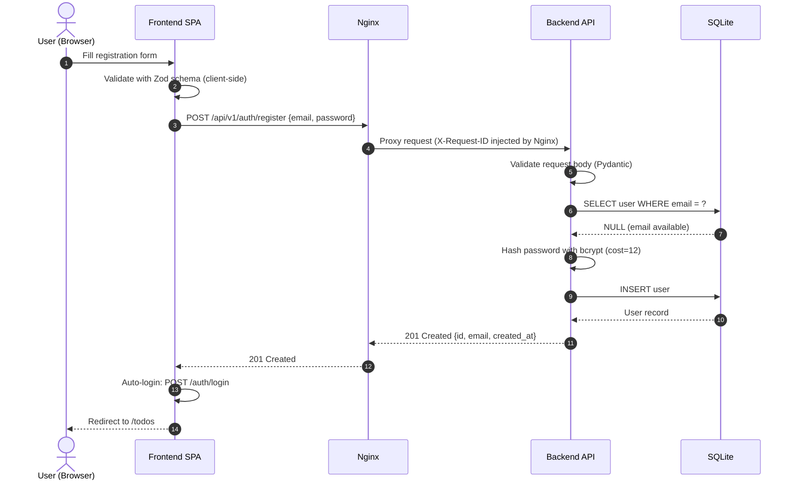
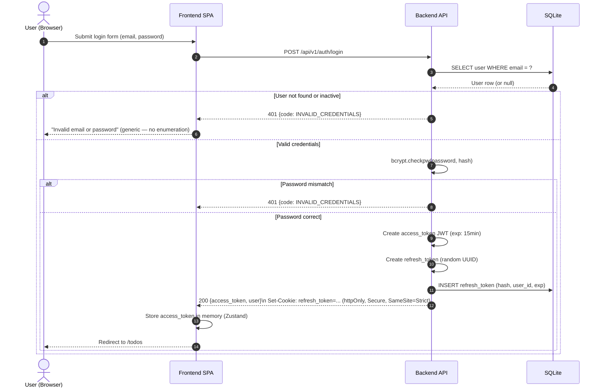
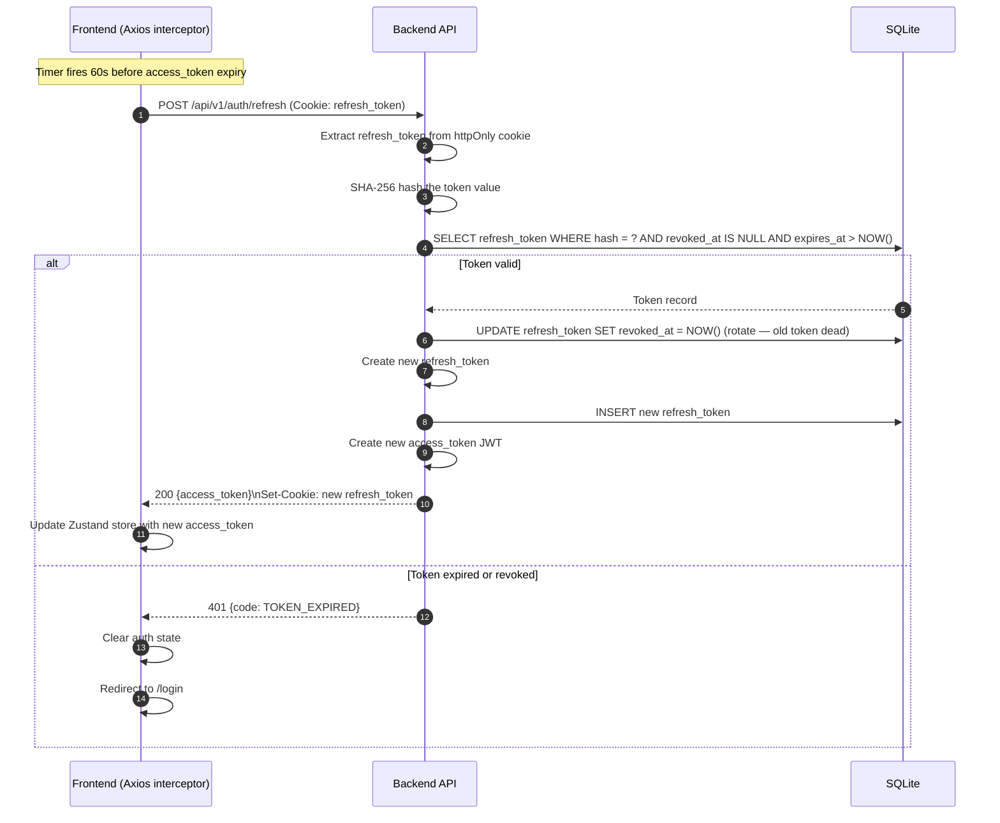
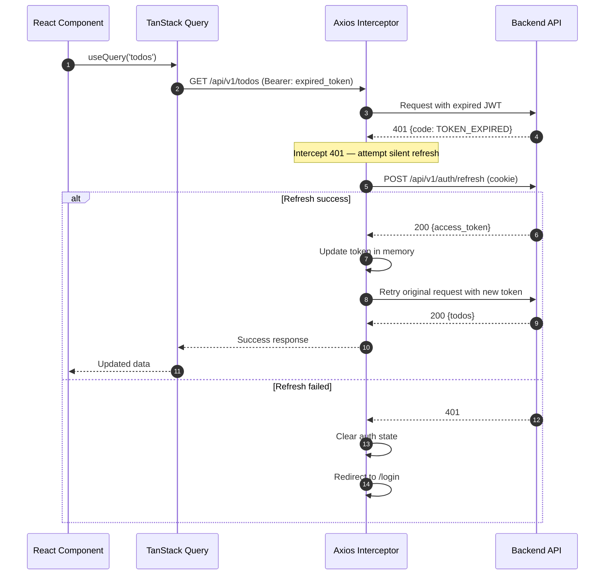
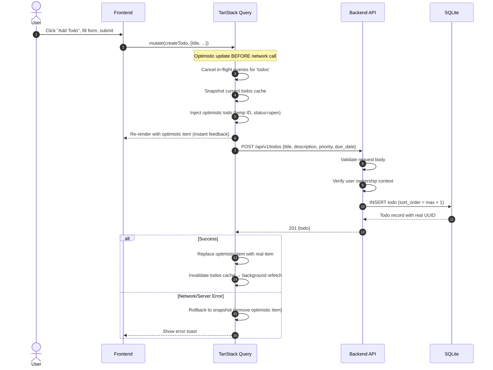
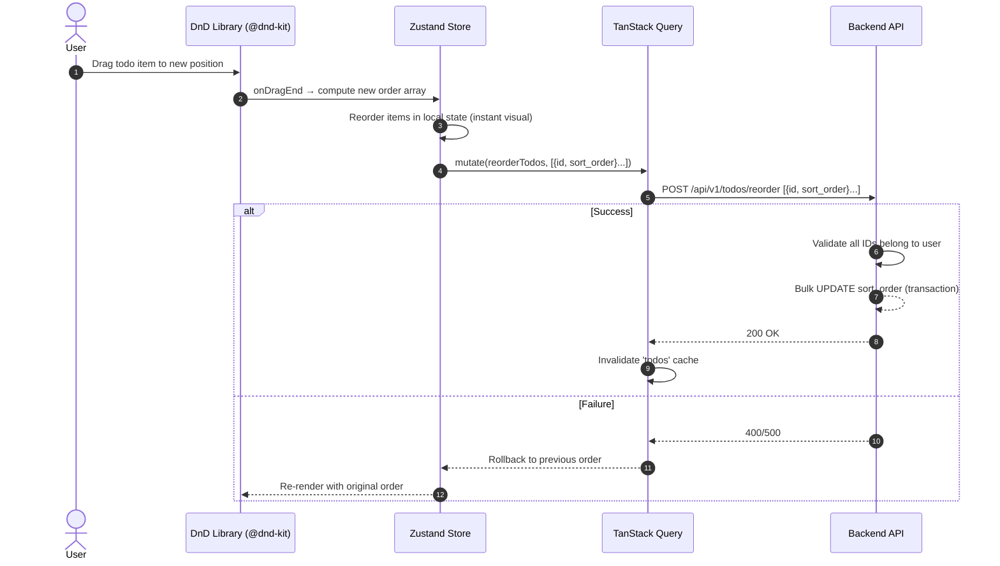
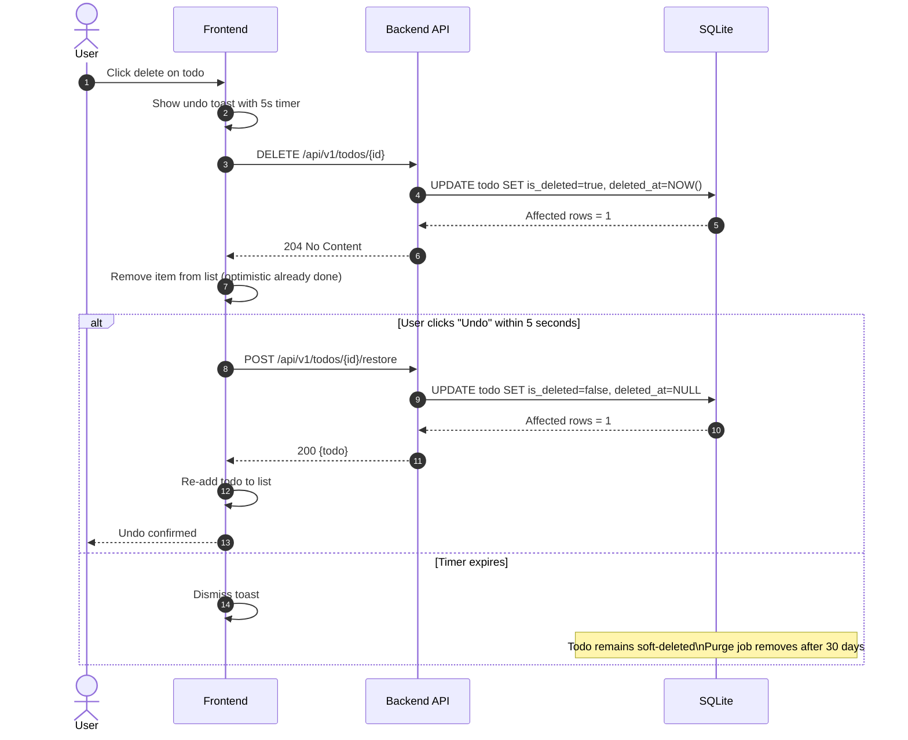

# Sequence Diagrams

**Version:** 1.0.0 | **Date:** 2026-05-27

---

## Auth Flow — Register



---

## Auth Flow — Login & Token Issuance



---

## Auth Flow — Silent Token Refresh



---

## Auth Flow — 401 Interceptor (Request Mid-Flight)



---

## Todo CRUD — Create with Optimistic Update



---

## Todo Reorder (Drag-and-Drop)



---

## Soft Delete & Restore Flow



---

## Health & Readiness Check

```mermaid
sequenceDiagram
    participant Orchestrator as Container Orchestrator
    participant API as Backend API
    participant DB as SQLite

    loop Every 10 seconds (liveness)
        Orchestrator->>API: GET /api/v1/health
        API-->>Orchestrator: 200 {status: "ok", uptime_s: 1234}
    end

    loop Every 5 seconds (readiness)
        Orchestrator->>API: GET /api/v1/ready
        API->>DB: SELECT 1 (lightweight ping)
        alt DB responsive
            DB-->>API: 1
            API-->>Orchestrator: 200 {status: "ready", db: "ok"}
        else DB not responding
            API-->>Orchestrator: 503 {status: "not_ready", db: "error"}
            Note over Orchestrator: Do NOT send traffic; restart if persistent
        end
    end
```
