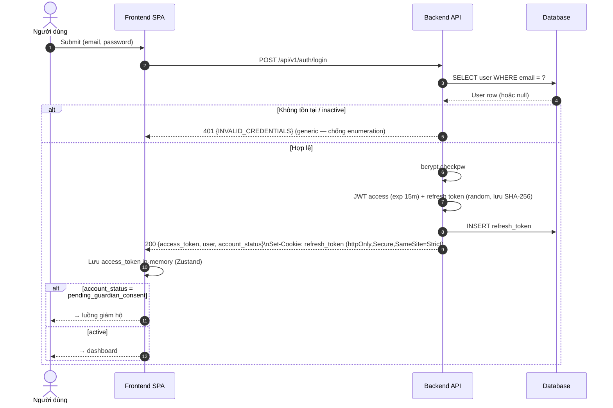
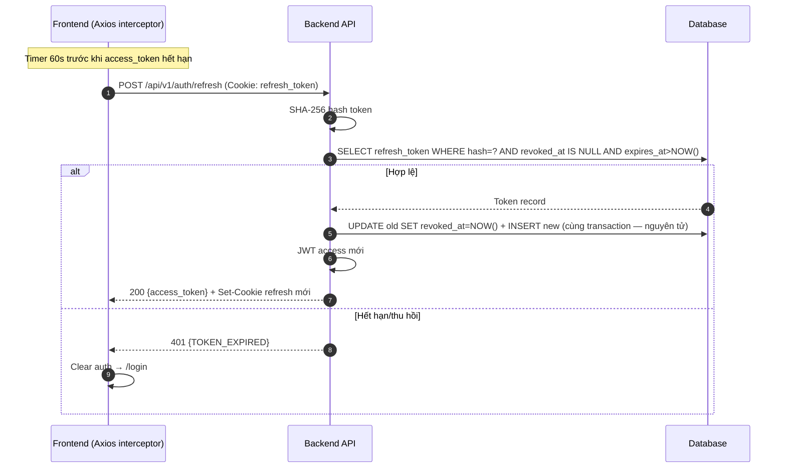
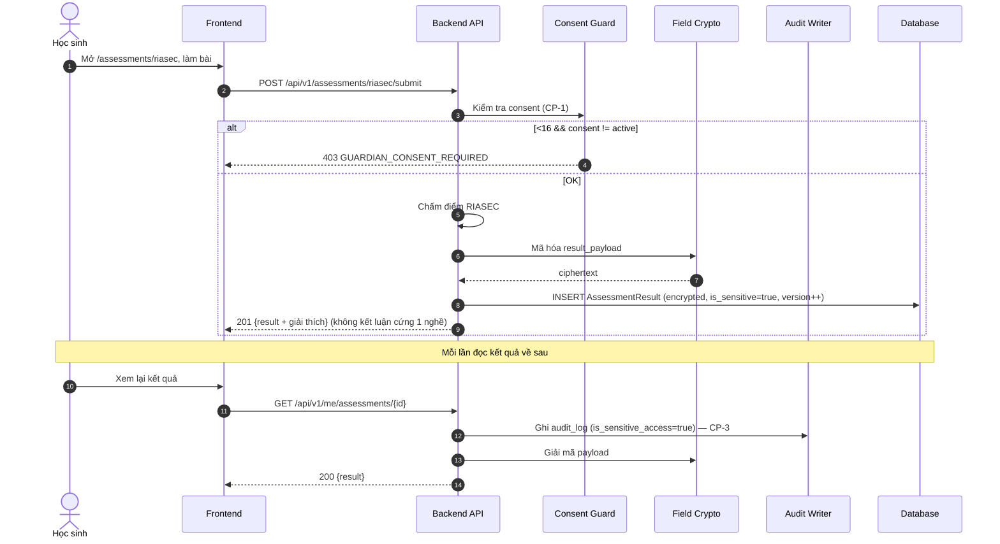
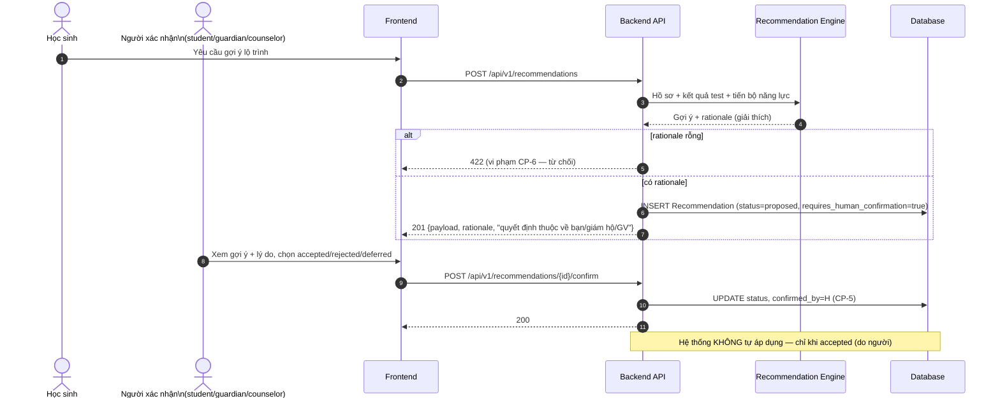
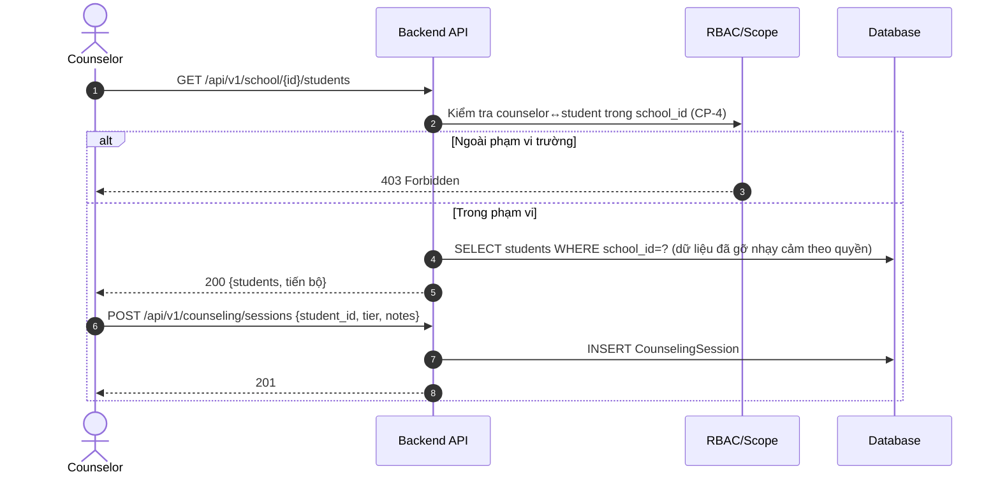

# Sơ đồ Tuần tự (Sequence Diagrams) — WeUp Career

**Phiên bản:** 2.0.0 | **Ngày:** 2026-05-29

> Neo vào [`docs/spec.md`](../spec.md) (FR + CP). Nhấn mạnh cổng giám hộ <16, xử lý dữ liệu nhạy cảm + audit, và gợi ý human-in-the-loop.

---

## Auth — Đăng ký (có cổng tuổi)

```mermaid
sequenceDiagram
    autonumber
    actor U as Người dùng (Browser)
    participant FE as Frontend SPA
    participant N as Nginx
    participant API as Backend API
    participant DB as Database

    U->>FE: Điền form đăng ký (email, password, date_of_birth)
    FE->>FE: Validate Zod (client)
    FE->>N: POST /api/v1/auth/register
    N->>API: Proxy (X-Request-ID)
    API->>API: Validate (Pydantic); suy ra age_band
    API->>DB: SELECT user WHERE email = ?
    DB-->>API: NULL (email khả dụng)
    API->>API: bcrypt hash (cost=12)
    alt age_band = under_16
        API->>DB: INSERT user (account_status=pending_guardian_consent)
        API-->>FE: 201 {id, account_status:"pending_guardian_consent"}
        FE-->>U: Điều hướng → luồng mời giám hộ
    else age_band ≥ 16
        API->>DB: INSERT user (account_status=active)
        API-->>FE: 201 {id, account_status:"active"}
        FE-->>U: Điều hướng → dashboard
    end
```

---

## ⭐ Đồng ý giám hộ (<16) — CP-1/CP-2

```mermaid
sequenceDiagram
    autonumber
    actor C as Học sinh <16
    actor G as Người giám hộ
    participant FE as Frontend
    participant API as Backend API
    participant DB as Database

    C->>FE: Nhập thông tin giám hộ (email/SĐT)
    FE->>API: POST /api/v1/guardians/invite
    API->>DB: Tạo GuardianLink (chưa verified)
    API-->>G: Gửi lời mời qua kênh độc lập (email / VNeID)
    G->>FE: Mở liên kết xác nhận
    G->>API: POST /api/v1/guardians/consent
    API->>API: Xác thực danh tính giám hộ (email/VNeID)
    API->>DB: GuardianLink.verified_at = NOW(); tạo GuardianConsent(status=active)
    API->>DB: UPDATE user SET account_status=active
    API-->>FE: 200 {consent: active}
    FE-->>C: Mở khóa trắc nghiệm & gợi ý

    Note over G,API: Bất cứ lúc nào — thu hồi:
    G->>API: POST /api/v1/guardians/consent/revoke
    API->>DB: GuardianConsent.status=revoked; user→pending
    API-->>FE: 200 — dừng xử lý dữ liệu MỚI (CP-2)
```

---

## Auth — Đăng nhập & phát hành token



---

## Auth — Refresh token im lặng (CP-7)



---

## ⭐ Làm trắc nghiệm RIASEC/VIPS/MBTI — dữ liệu nhạy cảm + audit (CP-1, CP-3)



---

## ⭐ Gợi ý có giải thích — Human-in-the-loop (CP-5, CP-6)



---

## Counselor — Tư vấn 3 tầng (CP-4 RBAC)



---

## Health & Readiness

```mermaid
sequenceDiagram
    participant Orchestrator as Container Orchestrator
    participant API as Backend API
    participant DB as Database

    loop Mỗi 10s (liveness)
        Orchestrator->>API: GET /api/v1/health
        API-->>Orchestrator: 200 {status:"ok", uptime_s}
    end
    loop Mỗi 5s (readiness)
        Orchestrator->>API: GET /api/v1/ready
        API->>DB: SELECT 1
        alt DB ok
            API-->>Orchestrator: 200 {status:"ready", db:"ok"}
        else DB lỗi
            API-->>Orchestrator: 503 {status:"not_ready"}
            Note over Orchestrator: Không gửi traffic; restart nếu kéo dài
        end
    end
```
