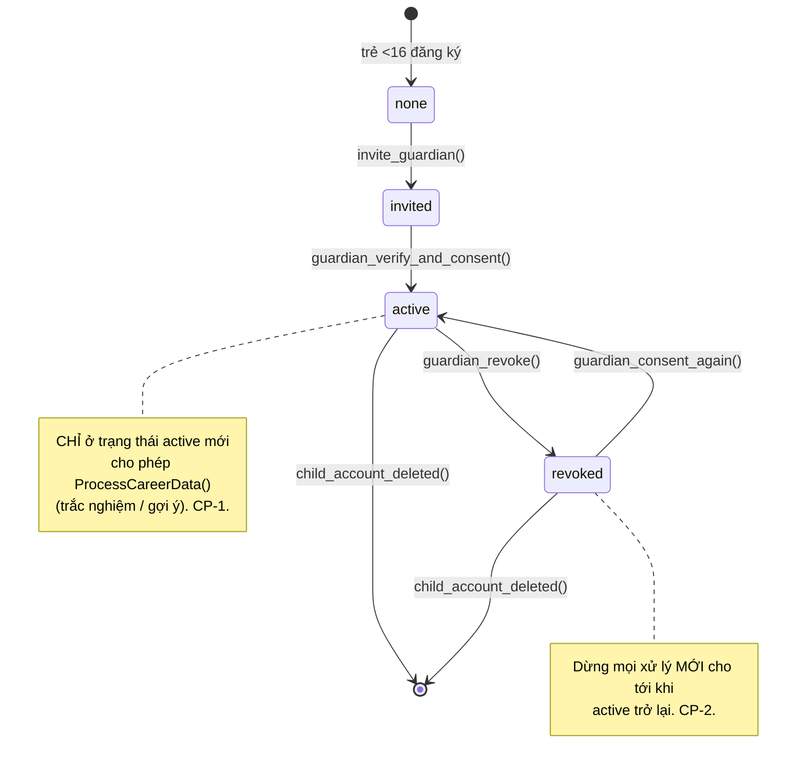
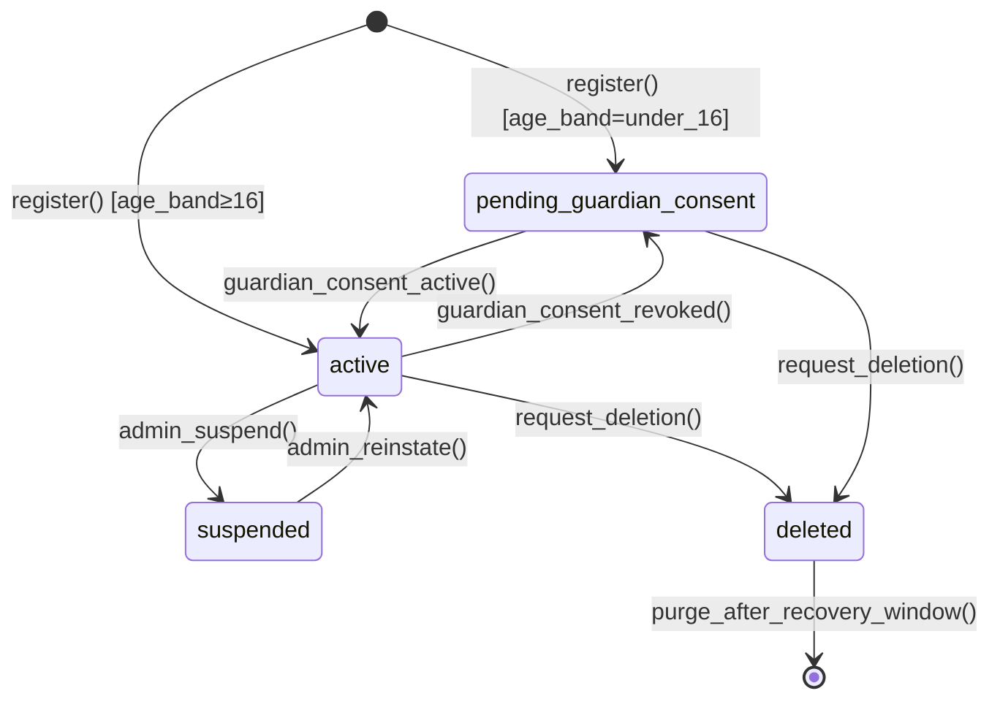
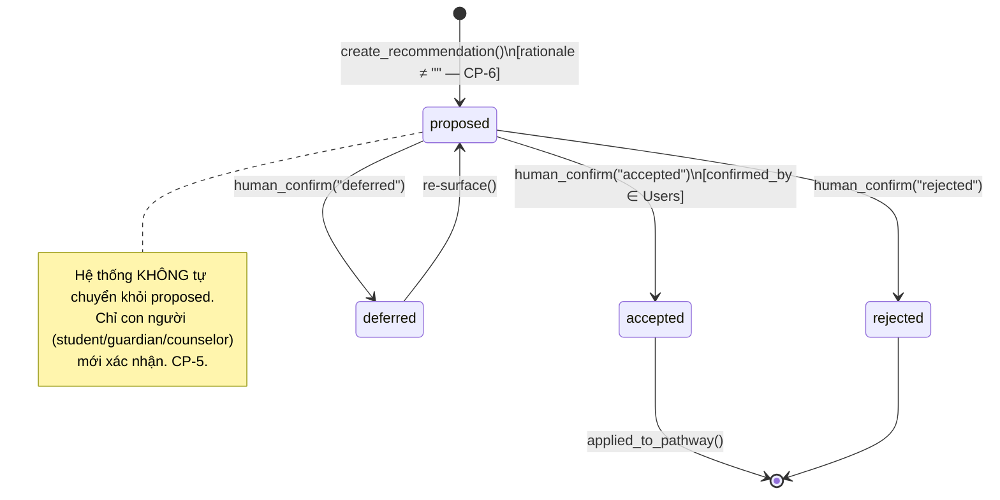
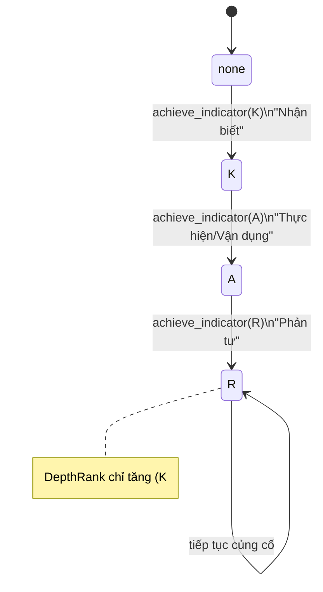
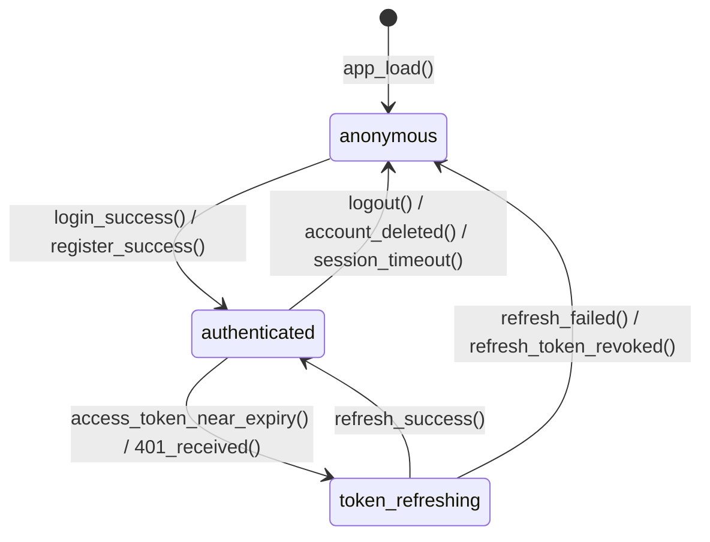
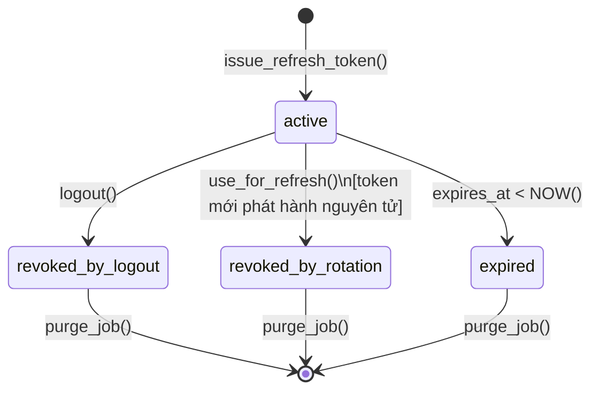
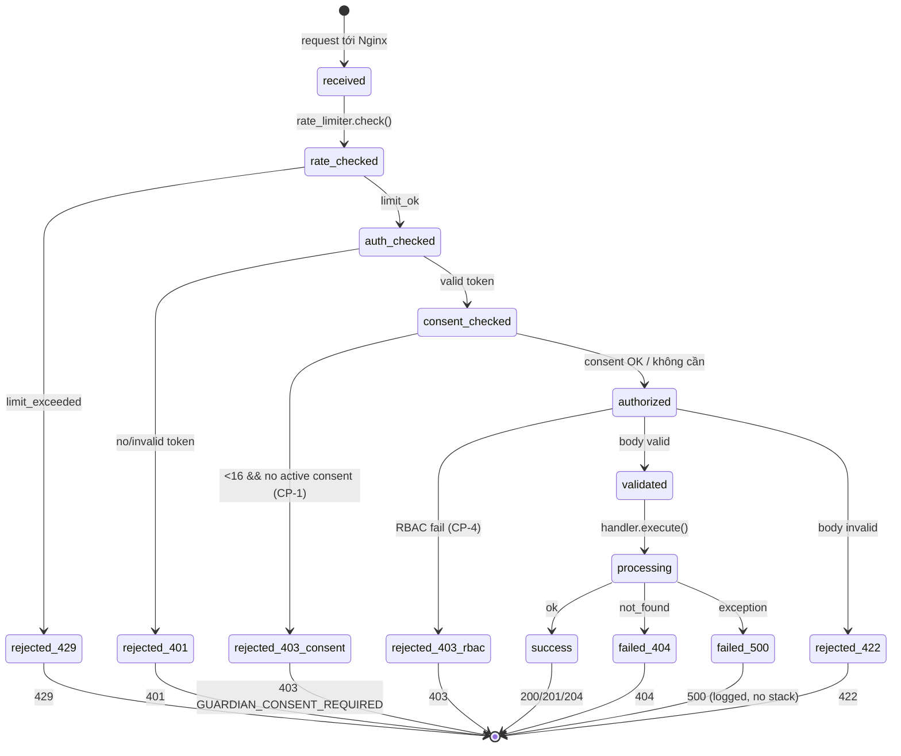
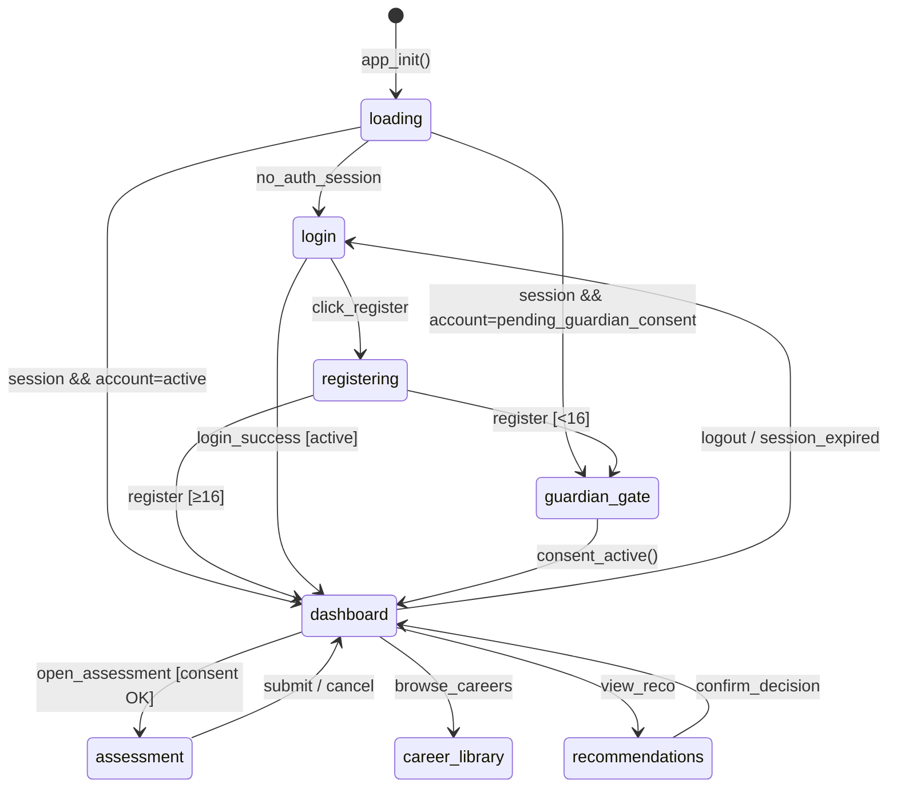
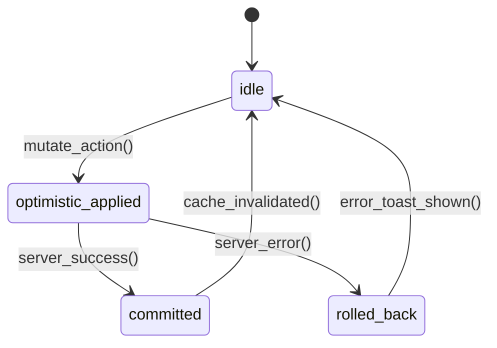

# Sơ đồ Trạng thái (State Diagrams) — WeUp Career

**Phiên bản:** 2.0.0 | **Ngày:** 2026-05-29

> Các FSM dưới đây là canonical cho TLA+ (xem [`docs/formal-verification/tla-spec-design.md`](../formal-verification/tla-spec-design.md)). Mỗi FSM gắn với thuộc tính đúng đắn (CP) trong [`docs/spec.md`](../spec.md) §8.

---

## ⭐ GuardianConsent State Machine (CP-1, CP-2) — bất biến pháp lý

FSM kiểm soát việc trẻ <16 có được xử lý dữ liệu hướng nghiệp hay không.

| Trạng thái consent | account_status tương ứng | Xử lý dữ liệu hướng nghiệp? |
|---|---|---|
| `none` / `invited` / `revoked` | `pending_guardian_consent` | ⛔ Không |
| `active` | `active` | ✅ Có |
| (≥16 không cần consent) | `active` | ✅ Có |

---

## Account Status State Machine

---

## ⭐ Recommendation State Machine (CP-5, CP-6) — human-in-the-loop

| Trạng thái | rationale | confirmed_by | Có hiệu lực phân luồng? |
|---|---|---|---|
| `proposed` | bắt buộc ≠ rỗng | NONE | Không |
| `accepted` | ≠ rỗng | người dùng | Có (sau khi người chấp nhận) |
| `rejected`/`deferred` | ≠ rỗng | người dùng | Không |

---

## ⭐ Competency Depth Progression (CP-8) — trục độ sâu K-A-R

Một `(learner, competency)` tiến trên trục độ sâu; **không lùi**, lịch sử append-only.

> Trục này **trực giao** với trục giai đoạn phát triển (Awareness→Exploration→Planning) — xem [`career-frameworks-synthesis.md`](../research/career-frameworks-synthesis.md) §3.

---

## Authentication Session State Machine

| State | access_token | refresh_token (cookie) | actor_id |
|-------|-------------|----------------------|---------|
| `anonymous` | null | absent | null |
| `authenticated` | valid JWT | present (httpOnly) | set |
| `token_refreshing` | expiring JWT (vẫn dùng được) | present | set |

> Khi `authenticated` nhưng `account_status = pending_guardian_consent`, frontend chỉ cho phép luồng giám hộ.

---

## Refresh Token Lifecycle (CP-7)

**Thuộc tính an toàn (CP-7):** chuyển `active → revoked_by_rotation` xảy ra cùng ranh giới giao dịch với token mới thành `active`. Không bao giờ tồn tại hai token active cho cùng phiên.

---

## Request Lifecycle State Machine (thêm cổng consent)

---

## Frontend Page State Machine

---

## Optimistic Update Conflict Resolution (UI)

> ⚠️ Không áp dụng optimistic update cho **gợi ý phân luồng** — gợi ý chỉ hiển thị sau khi server tạo (kèm rationale) và chỉ có hiệu lực sau xác nhận của người (CP-5).
