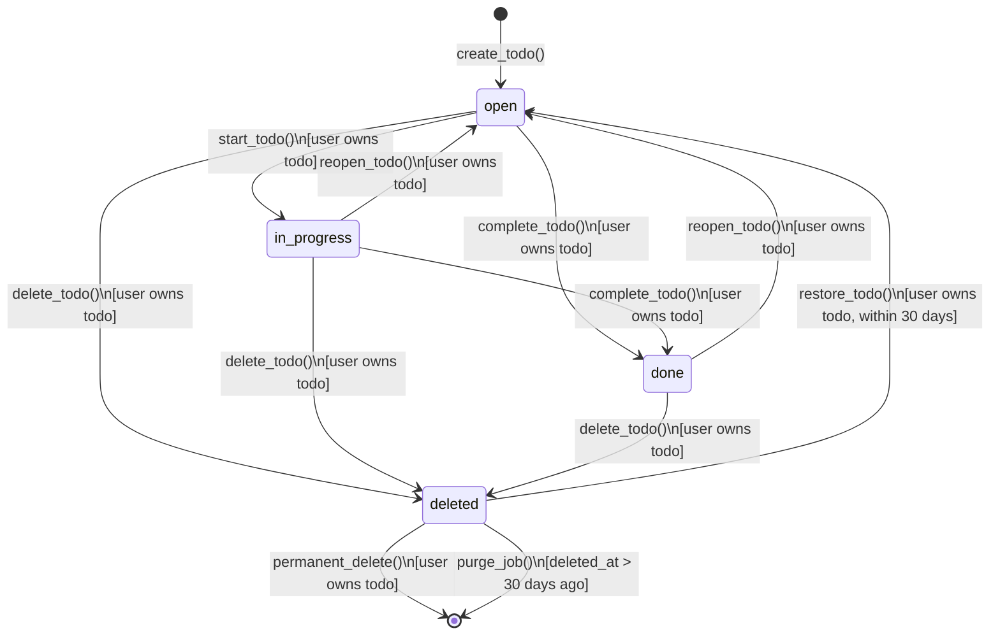
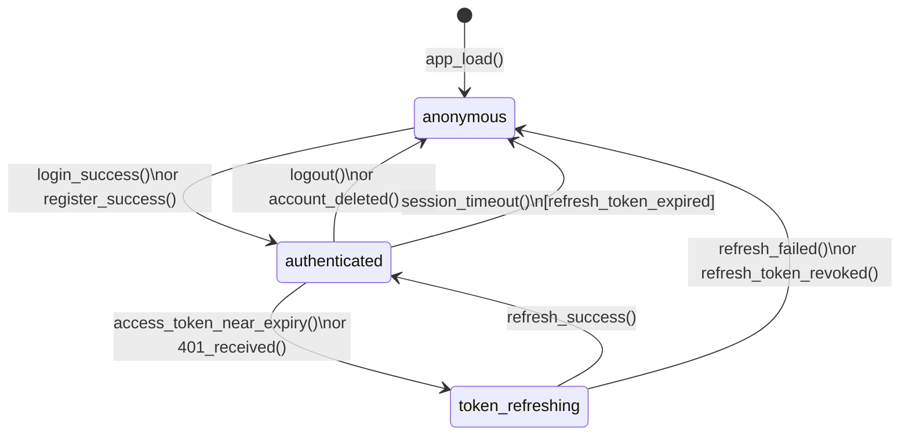
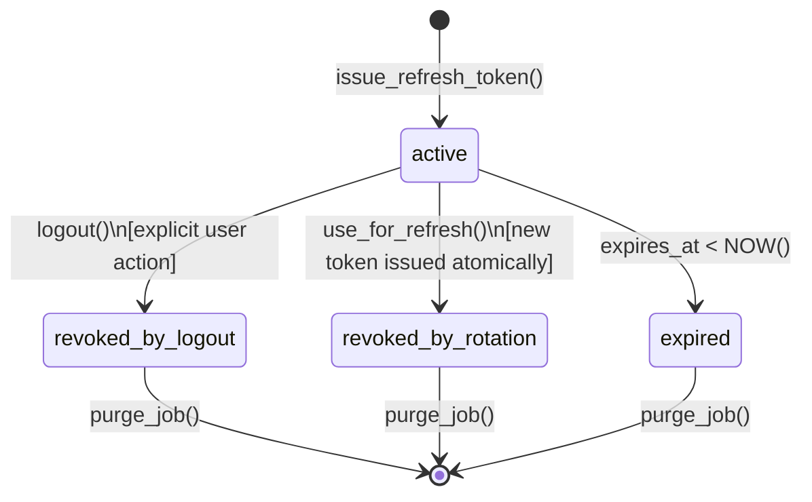
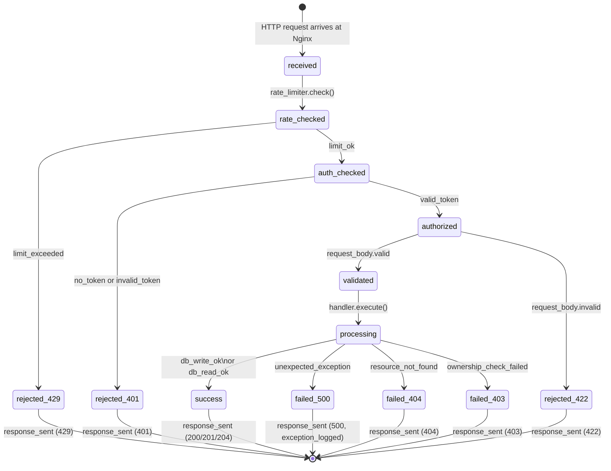
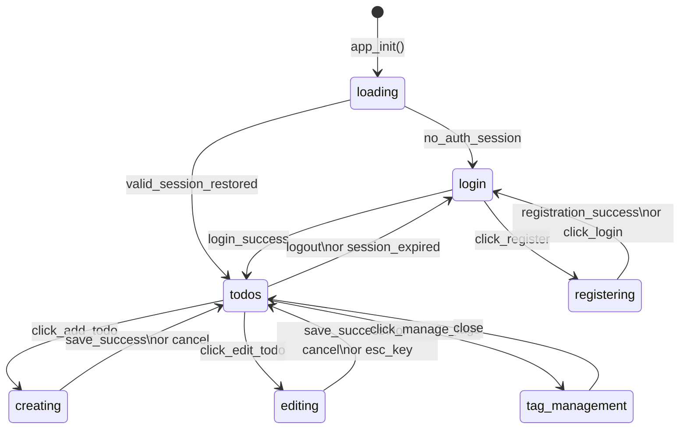
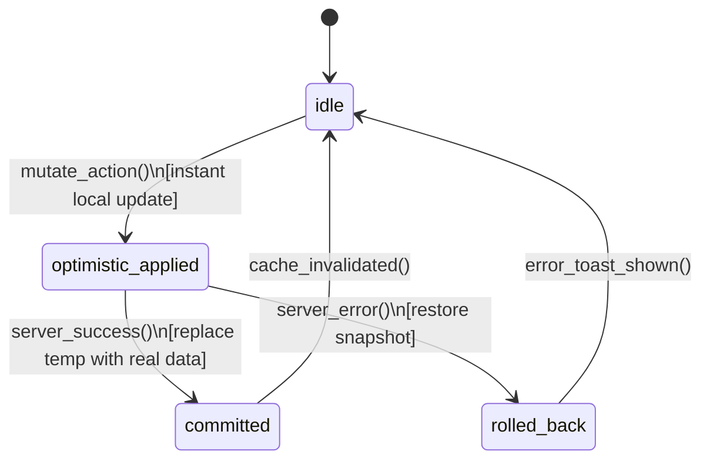

# State Diagrams

**Version:** 1.0.0 | **Date:** 2026-05-27

---

## Todo Item State Machine

This is the canonical FSM that TLA+ will verify.

### State Invariants

| State | Invariant |
|-------|-----------|
| `open` | `completed_at IS NULL`, `is_deleted = false` |
| `in_progress` | `completed_at IS NULL`, `is_deleted = false` |
| `done` | `completed_at IS NOT NULL`, `is_deleted = false` |
| `deleted` | `is_deleted = true`, `deleted_at IS NOT NULL` |
| `[* terminal]` | Row no longer queryable by any user |

### Valid Transitions Only (Rejected Paths)

- `done → in_progress` is **not allowed** (must reopen first)
- `deleted → done` is **not allowed** (must restore to open first, then complete)
- Any transition by a user who does not own the todo → **403 Forbidden**

---

## Authentication Session State Machine

### Session State Data

| State | access_token | refresh_token (cookie) | user_id |
|-------|-------------|----------------------|---------|
| `anonymous` | null | absent | null |
| `authenticated` | valid JWT string | present (httpOnly) | set |
| `token_refreshing` | expiring JWT (still usable) | present | set |

---

## Refresh Token Lifecycle

**Security property:** A refresh token transitions from `active → revoked_by_rotation` at the same database transaction boundary as a new token moving to `active`. There is never a moment where two valid tokens exist for the same session.

---

## Request Lifecycle State Machine

---

## Frontend Page State Machine

---

## Optimistic Update Conflict Resolution

