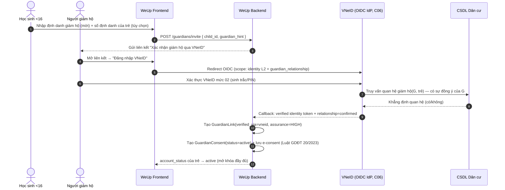

# Thiết kế Luồng Xác thực Người Giám hộ (VNeID) — WeUp Career

**Phiên bản:** 1.0.0 · **Ngày:** 2026-05-29 · **Đóng:** P-4 (punch list `validate-design` / [CRED_44A0BB13] B3.1 / [CRED_18E37BA5] A.7)

> Bổ sung lớp xác thực mạnh cho **đồng ý giám hộ của trẻ <16** (CP-1/CP-2, [ADR-010](../adr/ADR-010-guardian-consent.md)). Giải quyết điểm yếu MVP: **xác thực chỉ-email có thể bị giả mạo** (kẻ tấn công đăng ký email bất kỳ làm "giám hộ" rồi tự duyệt — threat-tree B3.1).
>
> **Căn cứ pháp lý:** NĐ **69/2024** (VNeID — tài khoản định danh điện tử, giá trị chứng minh tương đương giấy tờ; Cục C06 Bộ Công an); Luật GDĐT **20/2023** (chữ ký/[CRED_2C24711E] điện tử có giá trị pháp lý — e-consent); NĐ **88/2026** Đ.12 (hồ sơ học tập liên thông VNeID); Luật BVDLCN **91/2025** (tối thiểu hóa dữ liệu). Xem [`legal-basis.md` §6, §7.2, §9.5](../legal/legal-basis.md).

---

## 1. Vấn đề & điều VNeID giải được

Đồng ý giám hộ hợp lệ đòi **hai** điều, mà email **không** chứng minh được:
1. **Người giám hộ đúng là họ** (định danh đảm bảo) — email chỉ chứng minh "kiểm soát hộp thư".
2. **Người đó đúng là giám hộ hợp pháp CỦA trẻ này** (quan hệ) — email không chứng minh quan hệ.

**VNeID đóng cả hai:**
- **Định danh đảm bảo** qua tài khoản VNeID **mức 02** (đã xác thực sinh trắc/giấy tờ với CSDL dân cư).
- **Xác minh quan hệ** giám hộ/[CRED_C82BD6C2] từ **CSDL quốc gia về dân cư** (giữ quan hệ cha/mẹ–con, người đại diện).
- **e-consent hợp pháp** (Luật GDĐT 20/2023) — chữ ký/[CRED_2C24711E] điện tử có giá trị pháp lý.
- **Dữ liệu nội địa** (Bộ Công an) ⇒ không phát sinh vấn đề chuyển xuyên biên giới.

> ⚠️ **Lưu ý mốc tuổi:** đủ điều kiện có VNeID (6/14 theo NĐ 69/2024) **≠** đủ năng lực tự đồng ý (<16 theo NĐ 147/2024). VNeID dùng để **xác thực giám hộ**, không phải để trẻ <16 tự đồng ý.

---

## 2. Ba tầng đảm bảo (assurance levels)

| Tầng | Cách đạt | Mở khóa xử lý dữ liệu |
|---|---|---|
| **HIGH** | Giám hộ đăng nhập VNeID **mức 02** + **CSDL dân cư xác nhận quan hệ** với trẻ | Toàn bộ (gồm dữ liệu **nhạy cảm** — kết quả trắc nghiệm) |
| **MEDIUM** | VNeID mức 02 (định danh đảm bảo) **nhưng quan hệ chưa khớp CSDL** (vd giám hộ pháp lý ≠ cha/mẹ ruột: nuôi dưỡng, đỡ đầu) → **kèm khai báo + xét duyệt** | Toàn bộ sau khi xét duyệt thủ công (school_admin/nghiệp vụ) |
| **LOW** (interim) | Email/OTP (MVP, hoặc giám hộ chưa có VNeID) | **Chỉ nội dung công khai + tính năng không nhạy cảm**; **KHÔNG** trắc nghiệm/[CRED_F931E5D8] cho tới khi nâng tầng |

> **Quyết định chính sách (đề xuất):** xử lý **dữ liệu nhạy cảm của trẻ <16** (kết quả RIASEC/VIPS/MBTI) **yêu cầu tối thiểu MEDIUM**. LOW chỉ là bước quá độ MVP, không đủ cho dữ liệu nhạy cảm. Điều này biến cảnh báo P-4 thành ràng buộc thực thi (fitness FF-19).

---

## 3. Luồng V1 — VNeID (mạnh, mặc định GA)

**Điểm khóa an toàn:** quan hệ do **CSDL dân cư** khẳng định, không do người dùng tự khai ⇒ B3.1 (giả mạo) bị chặn.

---

## 4. Luồng V2 — Email/OTP (fallback LOW, quá độ MVP)

Giữ luồng email hiện tại (ADR-010) nhưng:
- Gắn `assurance=LOW`; **không** mở khóa dữ liệu nhạy cảm (mục 2).
- Hiển thị rõ "đang ở mức xác thực cơ bản — nâng cấp qua VNeID để dùng đầy đủ".
- Có thể nâng tầng bất kỳ lúc nào bằng luồng V1.

## 5. Luồng V3 — Giám hộ không-khớp-CSDL (cạnh)

Giám hộ hợp pháp không phải cha/mẹ ruột (nhận nuôi, đỡ đầu, cơ sở bảo trợ) → quan hệ không có trong CSDL dân cư:
- VNeID xác thực **định danh** (đạt MEDIUM) + **khai báo quan hệ + upload giấy tờ giám hộ** → **xét duyệt thủ công** (nghiệp vụ/school_admin) → nâng HIGH.
- Trung thực: đây là khoảng cần quy trình con người; không tự động hóa được hoàn toàn.

---

## 6. Hệ quả Data Model (delta `spec.md` §5)

`GuardianLink` bổ sung:
| Field | Kiểu | Ghi chú |
|---|---|---|
| `verification_method` | enum `email \| vneid \| manual` | (đã có email/vneid; thêm manual cho V3) |
| `assurance_level` | enum `low \| medium \| high` | điều khiển chính sách mở khóa (mục 2) |
| `relationship_source` | enum `self_attested \| csdl_dancu \| document` | nguồn xác minh quan hệ |
| `verified_at` | timestamp | thời điểm xác thực |
| `vneid_ref` | string (token/[CRED_47D33EAF]) | **tham chiếu tối thiểu** — KHÔNG lưu số định danh/CCCD thô |

`GuardianConsent` bổ sung: `econsent_ref` (bằng chứng e-consent Luật GDĐT 20/2023), `assurance_at_grant`.

---

## 7. Tối thiểu hóa dữ liệu & quyền riêng tư (BVDLCN)

- **Chỉ lưu kết quả xác minh** (quan hệ confirmed + assurance + thời điểm + tham chiếu), **không** lưu bản sao dữ liệu CSDL dân cư, **không** lưu số CCCD/[CRED_30B79AEC] thô nếu không cần thiết.
- Truy cập `vneid_ref` ghi audit (như dữ liệu nhạy cảm).
- Số định danh của trẻ (nếu thu thập để truy vấn quan hệ) xử lý ở mức bảo vệ cao; cân nhắc chỉ truyền tới VNeID, không lưu tại WeUp.
- Phù hợp NĐ 88/2026 Đ.12 (liên thông VNeID) nhưng WeUp là "tổ chức khác" (Đ.4) ⇒ tối thiểu hóa.

## 8. Xử lý lỗi & khả dụng (VNeID là phụ thuộc ngoài)

| Tình huống | Hành xử |
|---|---|
| VNeID không khả dụng | Cho phép V2 (LOW) tạm thời; nhắc nâng cấp; **không** mở dữ liệu nhạy cảm |
| Quan hệ CSDL trả "không khớp" | Hạ về MEDIUM + luồng V3 (khai báo + giấy tờ) |
| Người dùng từ chối scope quan hệ | Chỉ đạt định danh (MEDIUM) → V3 |
| Thu hồi: giám hộ rút đồng ý | CP-2 — dừng xử lý mới (độc lập với assurance) |

## 9. Fitness function (bổ sung catalogue)

**FF-19** — *Dữ liệu nhạy cảm của trẻ <16 chỉ xử lý khi `assurance_level ≥ MEDIUM`.*
- Loại: Test-time. Cơ chế: integration test — `assurance=low` + submit trắc nghiệm → 403; `assurance≥medium` → cho phép.
- Nguồn: mục 2, P-4. (Thêm vào [`fitness-functions.md`](../validation/weup-career/fitness-functions.md).)

## 10. Tồn dư sau thiết kế

- **Tích hợp VNeID thật** cần đăng ký với C06/cổng định danh quốc gia + thỏa thuận chia sẻ quan hệ (CSDL dân cư) — **thủ tục hành chính**, ngoài phạm vi code; lập sớm.
- Khả dụng scope "guardian_relationship" qua VNeID/CSDL dân cư cần **xác nhận với cơ quan** (có thể chưa expose public API ⇒ V3 thủ công là fallback bắt buộc).
- Cập nhật [ADR-010](../adr/ADR-010-guardian-consent.md) (verification step) và data model `spec.md` §5 khi chốt.

> **Kết quả:** P-4 đóng ở mức **thiết kế** — luồng phân tầng + chính sách mở khóa + delta data model + FF-19 + xử lý lỗi. **Execution** cần tích hợp VNeID thật (thủ tục + code). Threat B3.1 được giảm thiểu: quan hệ giám hộ do CSDL dân cư khẳng định, không do tự khai.
