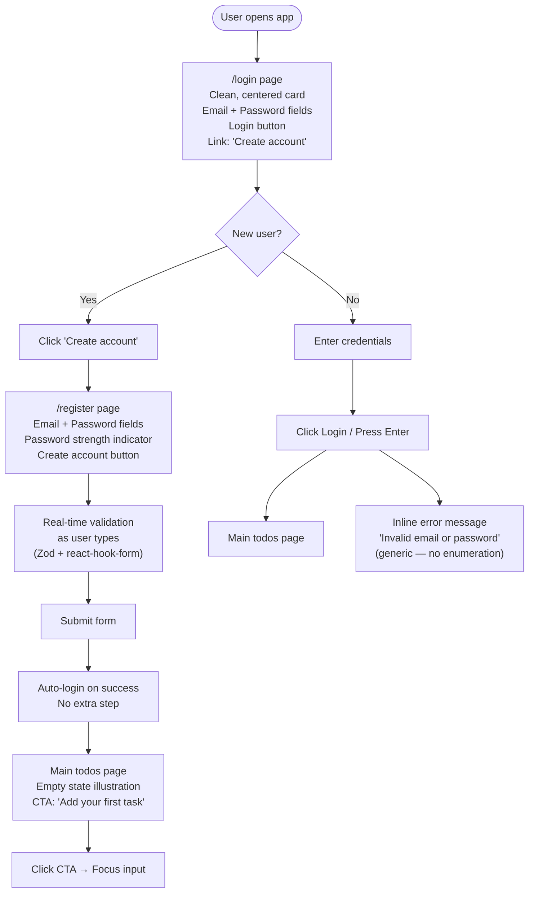
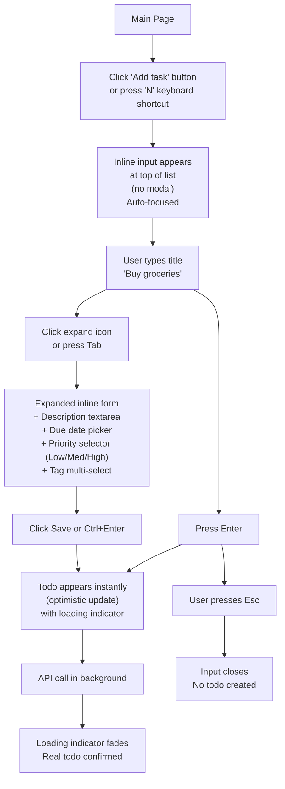
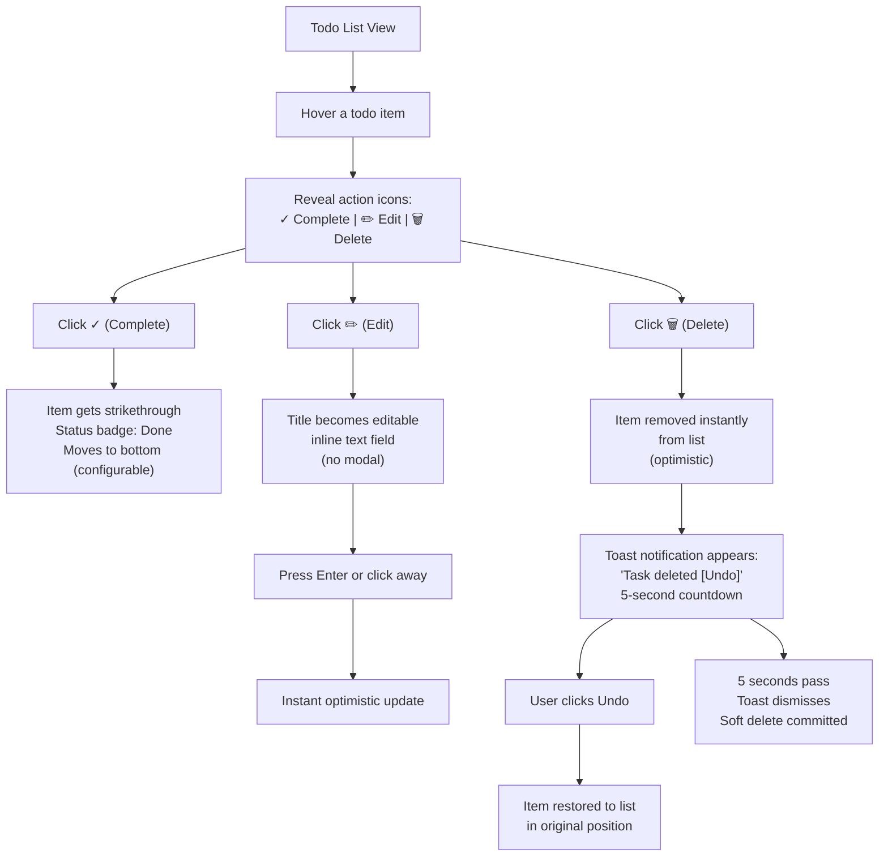
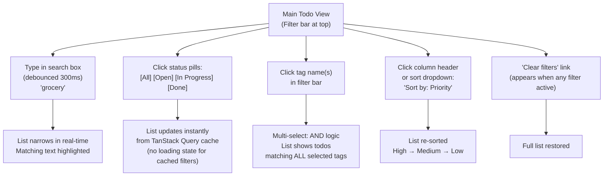
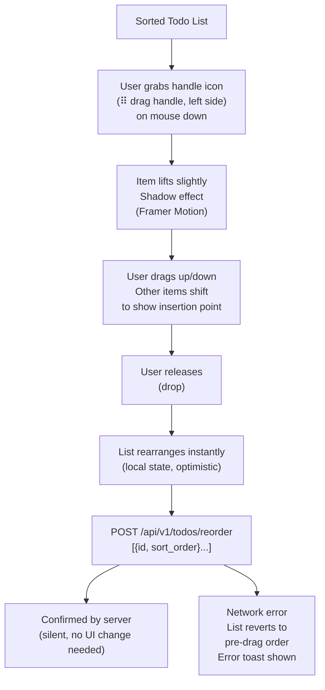

# UX Design: User Flows

**Version:** 1.0.0 | **Date:** 2026-05-27  
**Design Philosophy:** Eliminate friction. Every interaction should feel instant.

---

## Design Principles

These are non-negotiable product constraints, not suggestions:

1. **Zero friction for the primary action**: Creating a todo should take exactly one click + typing + Enter. No modal required.
2. **Instant feedback**: Every action has an immediate visual response (optimistic update or loading state). No request should feel slow.
3. **Safe to be wrong**: Destructive actions (delete) are reversible within 5 seconds. No confirmation dialog — just instant action + undo.
4. **Progressive disclosure**: Advanced features (due date, priority, tags) are accessible but not in the way.
5. **Keyboard-first**: Power users should never need to reach for the mouse.
6. **No visual noise**: Minimal UI. Plenty of whitespace. Task content is the hero.

---

## User Flow 1: Onboarding (First-Time User)



---

## User Flow 2: Creating a Todo (Primary Action)



---

## User Flow 3: Managing Todos



---

## User Flow 4: Filtering and Search



---

## User Flow 5: Drag-and-Drop Reorder



---

## Page Layouts

### Login / Register Page

```
┌─────────────────────────────────────────────────────────────┐
│                                                             │
│                     ✓ Todos                                 │
│                   (logo, centered)                          │
│                                                             │
│              ┌──────────────────────────┐                  │
│              │  Welcome back             │                  │
│              │                          │                  │
│              │  Email                   │                  │
│              │  ┌──────────────────┐   │                  │
│              │  │ user@example.com  │   │                  │
│              │  └──────────────────┘   │                  │
│              │                          │                  │
│              │  Password                │                  │
│              │  ┌──────────────────┐   │                  │
│              │  │ ••••••••••••      │   │                  │
│              │  └──────────────────┘   │                  │
│              │                          │                  │
│              │  ┌──────────────────┐   │                  │
│              │  │    Sign in       │   │                  │
│              │  └──────────────────┘   │                  │
│              │                          │                  │
│              │  Don't have an account? │                  │
│              │  Sign up                 │                  │
│              └──────────────────────────┘                  │
│                                                             │
└─────────────────────────────────────────────────────────────┘
```

### Main Todo Page

```
┌─────────────────────────────────────────────────────────────┐
│  ✓ Todos                            user@example.com ▾      │
├─────────────────────────────────────────────────────────────┤
│                                                             │
│  ┌─ Filter bar ─────────────────────────────────────────┐  │
│  │ 🔍 Search todos...    [All][Open][In Progress][Done]  │  │
│  │ Tags: [work ×] [personal ×]  Priority: [High ▾]       │  │
│  └───────────────────────────────────────────────────────┘  │
│                                                             │
│  ┌─ Add task ────────────────────────────────────────────┐  │
│  │  + What do you need to do?              [+ Add detail] │  │
│  └───────────────────────────────────────────────────────┘  │
│                                                             │
│  TODAY  ─────────────────────────────────────────────────   │
│                                                             │
│  ⠿ [ ] Buy groceries            🏷️ personal  📅 Today  ⚡   │
│  ⠿ [ ] Review PR #142           🏷️ work              🔥   │
│  ⠿ [✓] Book dentist appointment  🏷️ personal  ~~Done~~      │
│                                                             │
│  UPCOMING  ─────────────────────────────────────────────   │
│                                                             │
│  ⠿ [ ] Prepare quarterly report  🏷️ work   📅 Jun 1   🔥   │
│  ⠿ [ ] Call Mom                  🏷️ personal  📅 Jun 3  ─   │
│                                                             │
└─────────────────────────────────────────────────────────────┘

Legend: ⠿ drag handle  [ ] checkbox  ~~text~~ strikethrough
        🏷️ tag  📅 due date  🔥 high  ⚡ medium  ─ low priority
```

---

## Accessibility Design

### WCAG 2.1 AA Requirements

| Requirement | Implementation |
|-------------|---------------|
| Color contrast ≥4.5:1 | Tailwind design tokens with pre-tested contrast ratios |
| Keyboard navigation | All interactive elements reachable by Tab; focus ring always visible |
| Screen reader support | Radix UI components have ARIA labels baked in; custom components use `aria-*` attributes |
| No color-only information | Priority shown with text + icon + color (never color alone) |
| Error messages associated with fields | `aria-describedby` links error messages to inputs |
| Focus management | After modal close/delete, focus returns to logical next element |
| Reduced motion | `prefers-reduced-motion` media query disables Framer Motion animations |

### Keyboard Shortcuts

| Shortcut | Action |
|----------|--------|
| `n` | Focus "new todo" input |
| `Escape` | Cancel current editing / close modal |
| `Enter` | Save todo (when input focused) |
| `Ctrl+Enter` | Save with expanded details |
| `/` | Focus search input |
| `Ctrl+Z` | Undo last action (within 5s window) |
| `j` / `k` | Navigate todo list (Vim-style — future) |

---

## Responsive Design

| Breakpoint | Layout |
|------------|--------|
| Mobile (< 640px) | Single column; filter bar collapses to a "Filters" button; no drag-and-drop (use tap-to-select reorder in v2) |
| Tablet (640–1024px) | Same as desktop with slightly tighter spacing |
| Desktop (> 1024px) | Full layout as shown in wireframe above; max-width: 800px centered |
| Wide (> 1280px) | Sidebar available for tag list (future); main column stays max-width |

---

## Micro-Interactions & Animations

**Philosophy:** Animations should feel responsive, not decorative. Every animation serves a functional purpose (communicate state change, guide attention).

| Interaction | Animation | Duration |
|-------------|-----------|----------|
| Todo created | Slide in from top + fade | 150ms |
| Todo deleted | Slide out to right + fade | 200ms |
| Todo completed | Checkbox fill + strikethrough | 200ms ease |
| Status badge change | Cross-fade | 100ms |
| Drag lift | Scale 1.02 + shadow | 150ms |
| Drag drop | Spring return to position | 200ms |
| Filter change | List items animate position change | 200ms |
| Toast appear | Slide up from bottom | 150ms |
| Page load | Skeleton shimmer | 300ms loop |

All animations respect `prefers-reduced-motion: reduce` — degraded to instant state changes.
