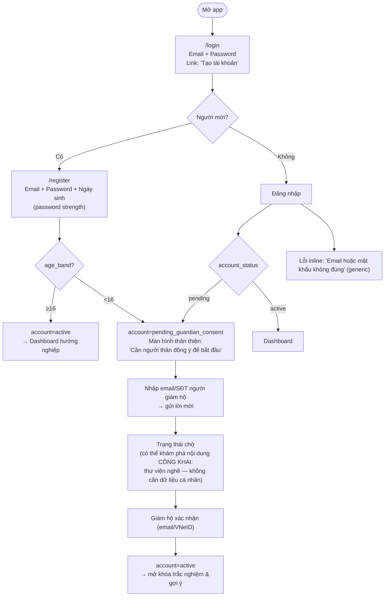
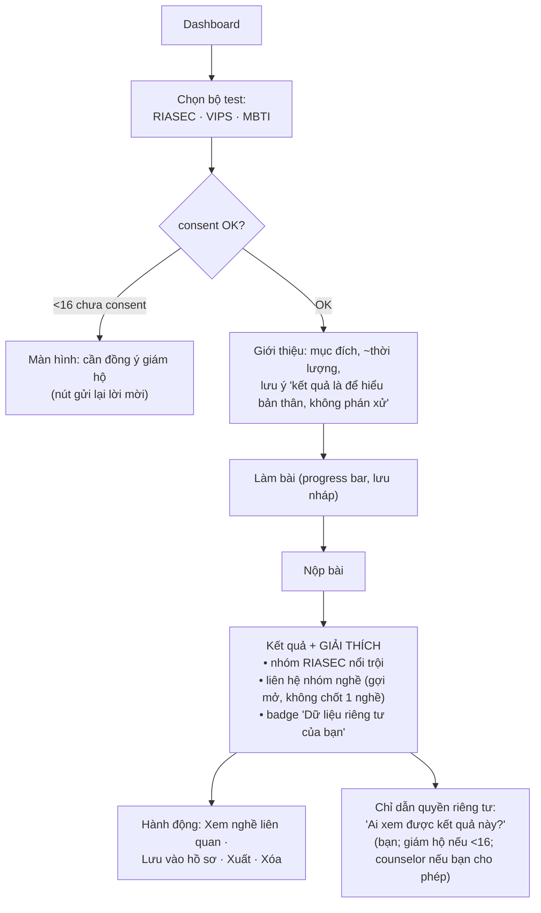
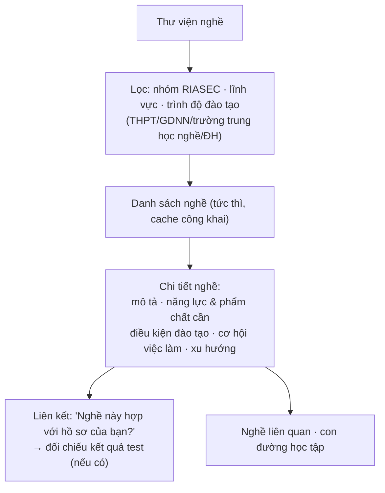
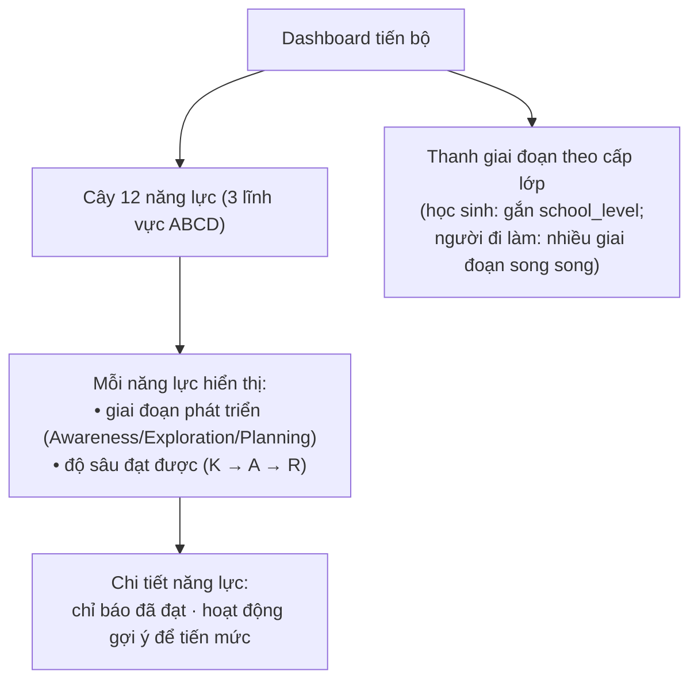
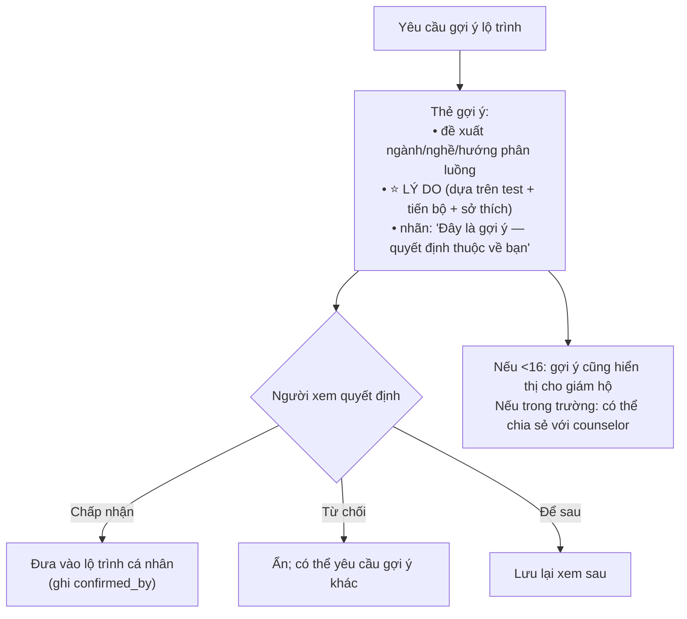
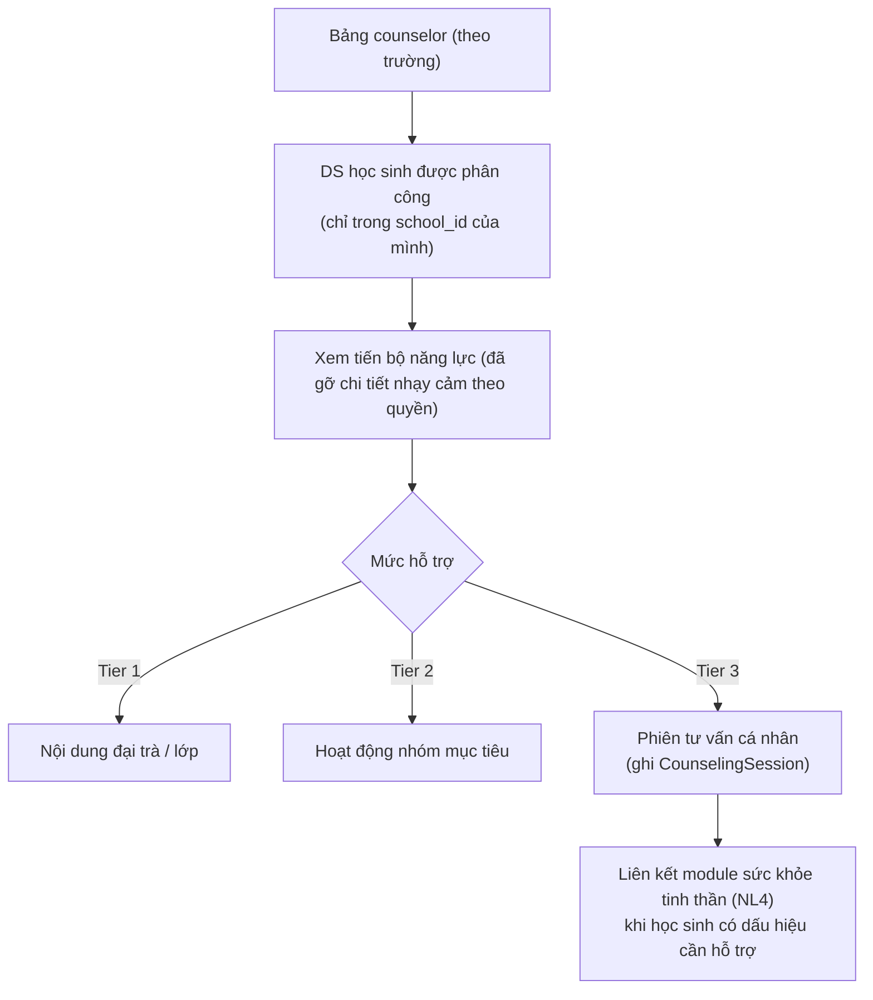

# Thiết kế UX: Luồng Người dùng — WeUp Career

**Phiên bản:** 2.0.0 | **Ngày:** 2026-05-29
**Triết lý:** Rõ ràng, an toàn, tôn trọng quyền tự quyết. Hướng nghiệp là **đồng hành**, không phán xử.
**Thay thế:** v1.0.0 (UX Todo app)

---

## Nguyên tắc thiết kế (ràng buộc sản phẩm, không phải gợi ý)

1. **An toàn & hợp pháp trước tiên:** trẻ <16 không vào được nội dung hướng nghiệp đến khi có **đồng ý giám hộ** — và điều này được giải thích rõ ràng, không gây hoang mang.
2. **Không ép buộc:** mọi gợi ý ngành/nghề/phân luồng đều **kèm lý do** và nhấn mạnh "quyết định thuộc về bạn / giám hộ / giáo viên" (TT 16/2026, Luật 134/2025).
3. **Tôn trọng riêng tư:** kết quả trắc nghiệm là **nhạy cảm** — luôn có chỉ dẫn về ai xem được, và lối tắt **xuất/xóa** dữ liệu của mình.
4. **Phù hợp lứa tuổi:** ngôn ngữ & độ phức tạp phân tầng theo `school_level` (Tiểu học → người đi làm).
5. **Phản hồi tức thì** cho thao tác không nhạy cảm (điều hướng, lọc nghề); **không** optimistic cho gợi ý phân luồng.
6. **Keyboard-first & WCAG 2.1 AA** xuyên suốt.

---

## Luồng 1: Onboarding + Cổng tuổi & Đồng ý giám hộ



> Trẻ <16 **vẫn xem được nội dung công khai** (thư viện nghề) khi chờ consent — chỉ phần xử lý dữ liệu cá nhân (trắc nghiệm/gợi ý) bị khóa. Tránh cảm giác "bị chặn cụt".

---

## Luồng 2: Làm trắc nghiệm định hướng (RIASEC / VIPS / MBTI)



---

## Luồng 3: Khám phá thư viện nghề (Điều 5a)



---

## Luồng 4: Bảng tiến bộ năng lực (2 trục K-A-R × giai đoạn)



> Trục độ sâu hiển thị theo ngôn ngữ VN: **Nhận biết → Thực hiện/Vận dụng → Phản tư** (khớp CTGDPT 2018).

---

## Luồng 5: Xem gợi ý nghề/lộ trình (Human-in-the-loop)



> ⛔ Không có nút "tự động áp dụng". Hệ thống **không** chuyển gợi ý thành lộ trình khi chưa có người xác nhận (CP-5).

---

## Luồng 6: Counselor — tư vấn 3 tầng



---

## Bố cục trang

### Trang Đăng nhập / Đăng ký
```
┌───────────────────────────────────────────┐
│              WeUp Career                    │
│         (Hướng nghiệp cùng bạn)            │
│        ┌──────────────────────┐            │
│        │  Chào mừng trở lại    │            │
│        │  Email  [__________]  │            │
│        │  Mật khẩu [________]  │            │
│        │  [     Đăng nhập    ] │            │
│        │  Chưa có tài khoản?   │            │
│        │  Tạo tài khoản        │            │
│        └──────────────────────┘            │
└───────────────────────────────────────────┘
```

### Dashboard học sinh
```
┌───────────────────────────────────────────────────────────┐
│  WeUp Career                         hocsinh@email  ▾       │
├───────────────────────────────────────────────────────────┤
│  Tôi là ai?   │  Tôi muốn đi đâu?  │  Đến đó bằng cách nào? │
│  (trắc nghiệm)│  (khám phá nghề)   │  (lộ trình & gợi ý)   │
├───────────────────────────────────────────────────────────┤
│  Tiến bộ năng lực:  [▓▓▓░░] Khám phá bản thân (A)           │
│                     [▓▓░░░] Thông tin nghề (K)              │
│  Gợi ý gần đây:  "Nhóm Investigative nổi trội — xem ngành…" │
│                  [Xem lý do]  [Chấp nhận] [Để sau]          │
│  🔒 Kết quả trắc nghiệm là dữ liệu riêng tư của bạn.        │
└───────────────────────────────────────────────────────────┘
```

---

## Thiết kế khả năng tiếp cận (Accessibility — WCAG 2.1 AA)

| Yêu cầu | Hiện thực |
|---|---|
| Tương phản ≥4.5:1 | Tailwind tokens đã test |
| Điều hướng bàn phím | Mọi phần tử reachable bằng Tab; focus ring rõ |
| Screen reader | Radix UI + `aria-*` |
| Không dùng màu đơn lẻ truyền tin | Giai đoạn/độ sâu hiển thị bằng text + icon + màu |
| Lỗi gắn với field | `aria-describedby` |
| Giảm chuyển động | `prefers-reduced-motion` tắt animation |
| Ngôn ngữ phù hợp lứa tuổi | Nội dung phân tầng theo `school_level` |

### Phím tắt
| Phím | Hành động |
|---|---|
| `/` | Focus ô tìm kiếm nghề |
| `Escape` | Hủy/đóng panel hiện tại |
| `g` rồi `a` | Tới Trắc nghiệm |
| `g` rồi `c` | Tới Thư viện nghề |
| `g` rồi `p` | Tới Tiến bộ |

---

## Responsive
| Breakpoint | Layout |
|---|---|
| Mobile (<640px) | 1 cột; 3 câu hỏi ECG xếp dọc; filter nghề thu gọn |
| Tablet (640–1024px) | Như desktop, spacing chặt hơn |
| Desktop (>1024px) | Layout đầy đủ; max-width nội dung đọc tốt |
| Wide (>1280px) | Sidebar cây năng lực (tùy chọn) |

---

## Micro-interactions
| Tương tác | Animation | Thời lượng |
|---|---|---|
| Hoàn thành 1 bước test | progress fill | 200ms |
| Đạt mức năng lực mới (K→A→R) | badge pop + confetti nhẹ | 250ms |
| Mở thẻ gợi ý | slide + fade | 150ms |
| Lọc nghề | list reposition | 200ms |
| Toast | slide up | 150ms |

Tôn trọng `prefers-reduced-motion: reduce` — chuyển thành đổi trạng thái tức thì.
